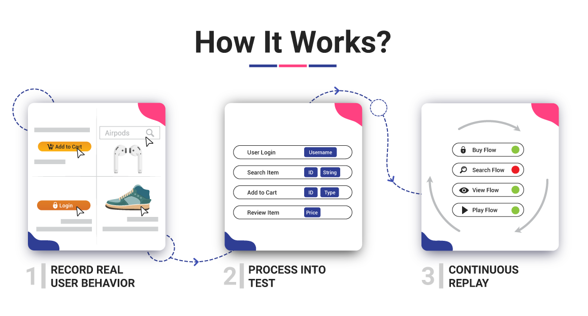

# What is Loadmill?

Loadmill helps companies move faster by keeping R&D teams focused on what matters. 

Regression testing is a bottleneck. Developers should spend less time testing and more time on solving meaningful problems.

Loadmill automates backend regression testing by replaying real user behavior. Using smart recordings, Loadmill can create and replay thousands of API tests based on actual user flows within minutes. 

* First things first, let's set up your Loadmill account, [sign up](https://www.loadmill.com/app/signup)!
* Want to record some API tests yourself? Start recording using the [Loadmill Chrome extension](https://chrome.google.com/webstore/detail/loadmill-recorder/gdkmnfehipofdefhpegbgkkocinlaofd?hl=en).
* Our team will be happy to help you with your questions at [support@loadmill.com](mailto:support@loadmill.com)   

