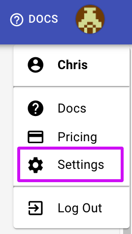
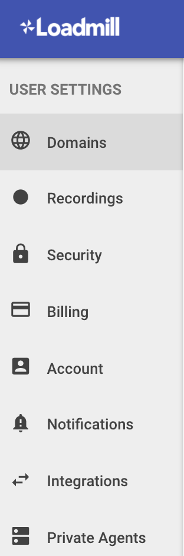

# Settings

You may find the Settings page by clicking on the user's Avatar on the top right corner of the page:

In the Settings, you can find tabs: [Domains](https://docs.loadmill.com/load-testing/setup/domain-verification), [Recordings](https://docs.loadmill.com/working-with-the-recorder/recorder-settings), [Security](https://docs.loadmill.com/integrations/api-tokens), Billing, [Account](https://docs.loadmill.com/account-settings/account), Notifications, Integrations, [Private Agents](https://docs.loadmill.com/api-testing/testing-localhost-application). 

| Tab | Description |
| :--- | :--- |
| [Domains](https://docs.loadmill.com/load-testing/setup/domain-verification) | Verify and manage domains your Load tests are running against. |
| [Recordings](https://docs.loadmill.com/working-with-the-recorder/recorder-settings) | Team admins can configure the advanced Recordings settings for the [Loadmill recorder](https://docs.loadmill.com/working-with-the-recorder) and [Chrome recorder extension](https://docs.loadmill.com/api-testing/getting-started#creating-and-running-an-api-test-by-using-our-chrome-recorder-extension). |
| [Security](https://docs.loadmill.com/integrations/api-tokens) | Generate and revoke personal API Tokens. |
| Billing | Team admins can manage credit cards, switch plans, download [a CSV usage report](https://docs.loadmill.com/account-settings/usage-report).  |
| [Account](https://docs.loadmill.com/account-settings/account) | Admins can manage teams. All users can edit their display names. |
| Notifications | Set e-mail notifications upon test run completion.  |
| Integrations | Team admins can set and edit integrations preferences. |
| [Private Agents](https://docs.loadmill.com/api-testing/testing-localhost-application)              | See running Loadmill's agent/s. |

