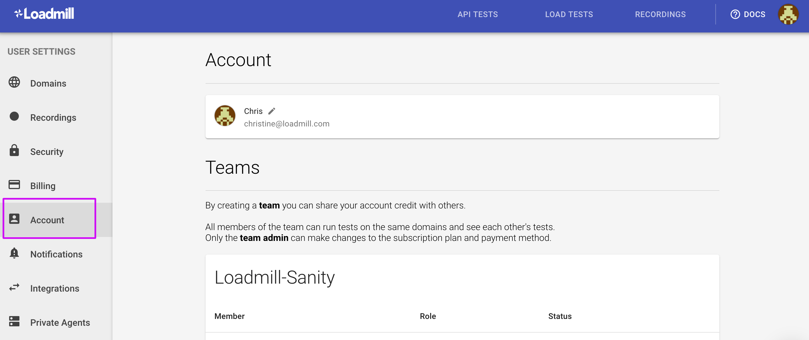

# Account

The Account tab within Settings allows admins to manage teams and all users to change their display names.

## Teams 

1. There are **two user roles** in Loadmill: **admin** and **member**. All members of the team can run tests on the same domains and see each other's tests. Only the team admins can make changes to the subscription plan, payment method, [Recordings settings](https://docs.loadmill.com/working-with-the-recorder/recorder-settings) and configure Integrations.
2. By default, a new user can create a new team unless he has already been added to one. 
3. To join another team, the user should ask the admin of this team to add him to it \(unless the team's subscription plan is not Free hence the user should be removed by the admin of the "old" team first in order to join the "new" team.
4. Admins can add more members to their teams unless their subscription plan is [Free](https://www.loadmill.com/#pricing). 

