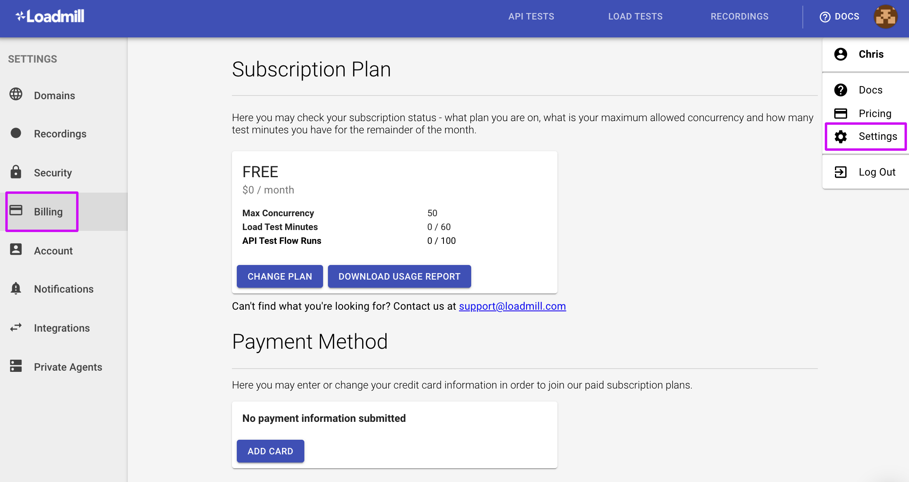
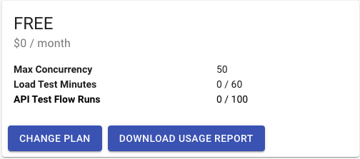

# Billing

Team admins can navigate to **Settings => Billing** to manage the account subscription plan, payment method and download Usage Report. 

Subscription Plan shows your current plan, what your maximum allowed concurrency is, how many test minutes you have used this month and how many test flows you've run. See an example below:

It shows that:

* You can run tests with 50 concurrent user sessions maximum.
* You have used 0 out of 60 test minutes for Load tests and 0 out of 100 API Test Flow runs this month.


:man_mage: API Test Flow Runs: we count only test flow runs that were run as a part of the Test Suite (via the Run Suite button) and don’t count single test flow runs with regards to billing.


Keep track of your monthly usage by using [this report](https://docs.loadmill.com/account-settings/billing/usage-report) and if you need more credit, easily upgrade your subscription plan by clicking **Change Plan**. 
