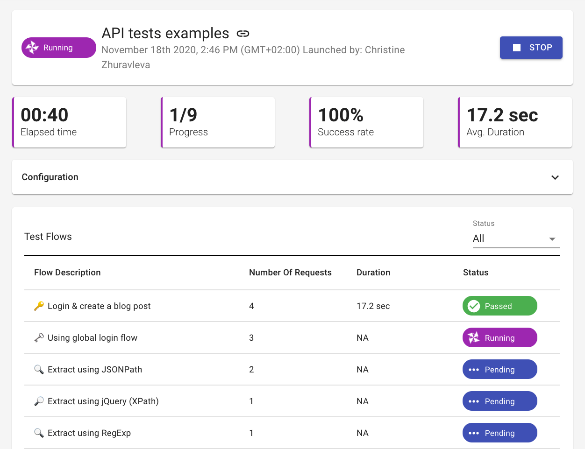

# API Testing

Loadmill's platform can help your team move faster by creating user flows from real user session in your application. Use Loadmill's smart recorder of users flows, generate these recordings to Test Suites and run it within minutes. 

## How can Loadmill's API testing help me and my team?

Creating and maintaining tests require endless iterations from release to release. Every small change can break your automation and increase your regression cycles.  

### What is the benefit of recording real user flows in production?

Save precious time scripting your tests and focus it on what users really care about. 

### 

