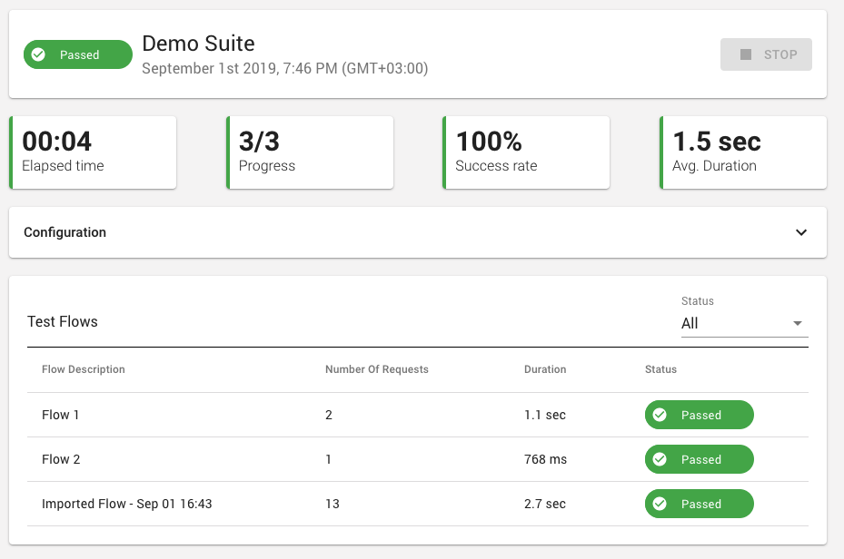
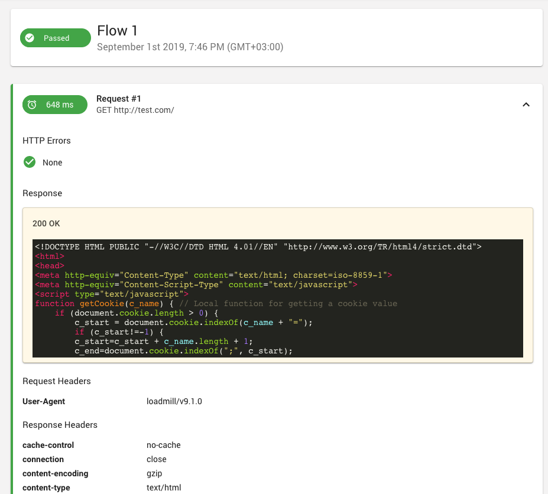

# Running a Test Suite

## Test Suite Run report

Right after your API test starts running you'll be transformed to the Test Suite Run report page. The Test Suite Run report page shows the list of executed flows as defined in the editor. The Test Flows table shows each flow's description, number of its requests, duration and status.

Use the table filter to filter by status.

In order to better analyze the results, the configuration of the Test Suite can be found right about the Test Flows table.

## Flow Status

A flow run has 2 statuses : Passed & Failed.   
NOTE: In cases where a flow fails - the whole Test Suite Run will fail.

You can drill down to a specific flow and review its requests report by clicking on the wanted flow name in the table. Once clicked, you'll be transformed to the Flow Report Page. 

