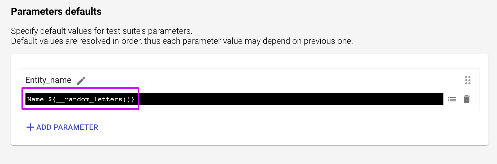
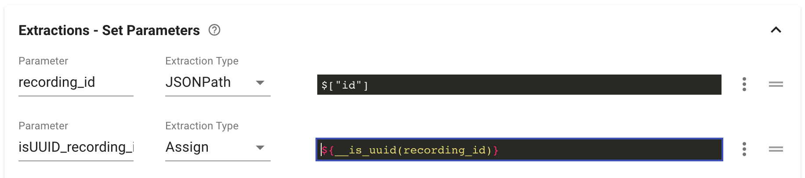
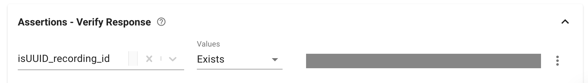

# API Testing FAQs

### **Functions**

**I'm testing entity creation where entity Name should be unique. Can I assign a set of random letters to it?**

Sure, create a parameter with using the `__random_letters([length=10])` function for that:

Find more great functions on [this page](https://docs.loadmill.com/api-testing/test-suite-editor/functions#randomization-functions) and more information about default parameters [here](https://docs.loadmill.com/api-testing/test-suite-editor/test-suite-parameters). 

**I’m getting id of my resource and I want to make sure it is in the format of UUID. How can I do that?**

You can easily do that by creating a new parameter that contains the extracted id and assigning to it value - [${\_\_is\_uuid\(extracted\_id\)}](https://docs.loadmill.com/api-testing/test-suite-editor/functions#__is_uuid-target). Then you can create an assertion that checks that the parameter exists. See an example below:

### \*\*\*\*

  

  

  

