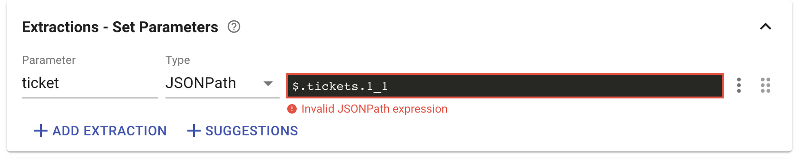
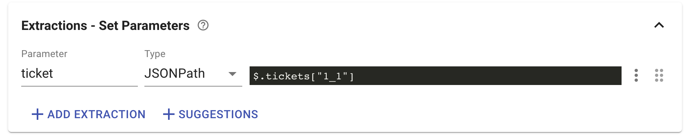

# API Testing troubleshooting

### I'm getting an error that my JSON Path expression is invalid, although the path is correct. What should I do?

That happens due to the underscore in the JSON Path expression, change it to be like shown below and it will work:

