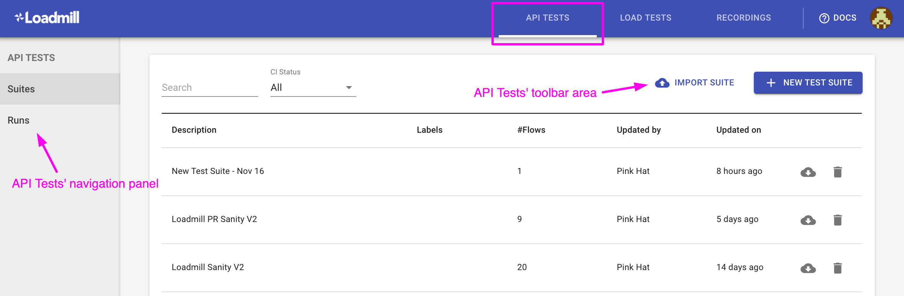
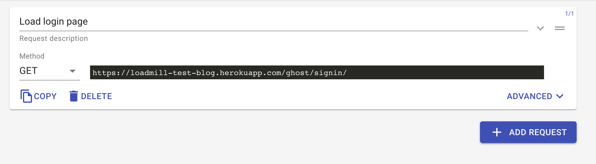
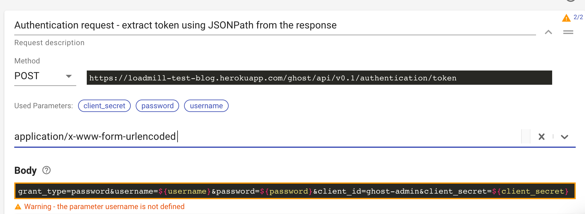
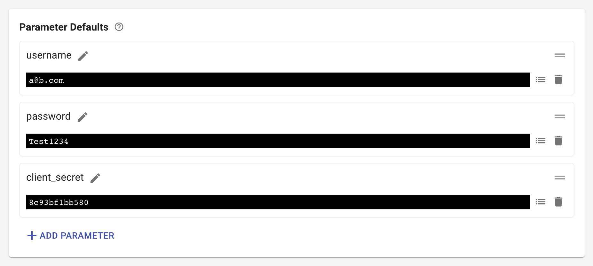

# Getting Started

The Loadmill's API testing module allows users to easily create automated API tests taken from real user sessions.

In this quick guide to [Loadmill](https://loadmill.com/app/signup) we will learn how to:

1. Create and run a very simple API test by using our [Chrome recorder extension](https://chrome.google.com/webstore/detail/loadmill-recorder/gdkmnfehipofdefhpegbgkkocinlaofd?hl=en).
2. Create and run an API test from scratch in Loadmill \(that is super easy and takes a few minutes\).

\*\*\*\*

## **Before you start**

**Signup to Loadmill** at this [link](https://www.loadmill.com/app/signup). If you need a demo application for testing you can use [this one](https://loadmill-test-blog.herokuapp.com). We do not ask for any credit card or personal information other than your name and email so it only takes about five seconds. You can also login using your Google or GitHub account. ****

In order to use Loadmill effectively, we highly recommend to read [Core definitions](https://docs.loadmill.com/core-definitions), don't worry, it is only a 2 min read. 😉 

## Let's create and run your first API test together. 

There are two ways to do that: 

* Recording an API test by using [our Chrome recorder extension](https://chrome.google.com/webstore/detail/loadmill-recorder/gdkmnfehipofdefhpegbgkkocinlaofd?hl=en) and running it in Loadmill.
* Creating and running an API test from scratch in Loadmill. 

### **Creating and running an API test by using our Chrome recorder extension:**



1. Download the extension [here](https://chrome.google.com/webstore/detail/loadmill-recorder/gdkmnfehipofdefhpegbgkkocinlaofd?hl=en).
2. Open the Chrome Developer Tools and switch to the Loadmill Rec tab. 
3. If you are not logged in to Loadmill, you will be prompted to the login page.
4. Create a Test Suite in Loadmill that will hold recorded flows, and select it in the extension. 
5. Clear the captured requests list and navigate to the tested website. 
6. Use the filter and the request's delete buttons to filter out irrelevant requests. 
7. When you are done recording your session click the "Upload" button at the bottom.
8. Go to Loadmill and open the recorded test in your Test Suite.
9. Run the Test Suite by pressing the "RUN SUITE" button and see your results. 🥳 

### Creating and running an API test from scratch in Loadmill:


🧙♂  Let's create an API test that validates user login to our [demo app](https://loadmill-test-blog.herokuapp.com/). 


1. Go to the API Tests tab.
2. Press the "NEW TEST SUITE" button, give it a name. ****
3. You can notice that there is one [Test flow](https://docs.loadmill.com/core-definitions) already created in it and you just need to fill it out. The first request will be to get our login page, enter its name, put URL - `https://loadmill-test-blog.herokuapp.com/ghost/signin/`  

4. Press the "ADD REQUEST" button. This will be an authentication request that will dynamically extract an access token and will allow user to log in to the app by using his username and password. Find more information about dynamic parameters [here](https://docs.loadmill.com/api-testing/test-suite-editor/parameters). 

5. Enter name - "Authentication request - extract token using JSONPath from the response", select "POST" as Method, put URL - `https://loadmill-test-blog.herokuapp.com/ghost/api/v0.1/authentication/token`    

6. Press "Advanced". This is a place where we set different [parameters](https://docs.loadmill.com/api-testing/test-suite-editor/parameters) taken from the response. Content type will be `application/x-www-form-urlencoded`  , body - `grant_type=password&username=${username}&password=${password}&client_id=ghost-admin&client_secret=${client_secret}`              

7. The warning you've got means that the parameters we set in the body as **username, password, client\_secret** are not defined yet. In order to define them, go to [the Parameters tab](https://docs.loadmill.com/api-testing/test-suite-editor/test-suite-parameters) and add them as shown below:

8. Now go back to the "Flows" tab and run your first API Test Suite by pressing the "RUN SUITE" button. That's it, you can see your results live in Loadmill. 🎉 This is only the beginning, continue exploring the guide to master your **Loadmill skills**!

### Support

We are always here if you need any help! Click on the bubble chat button in the lower-right corner of the screen or drop us a line at [support@loadmill.com](mailto:support@loadmill.com).  

