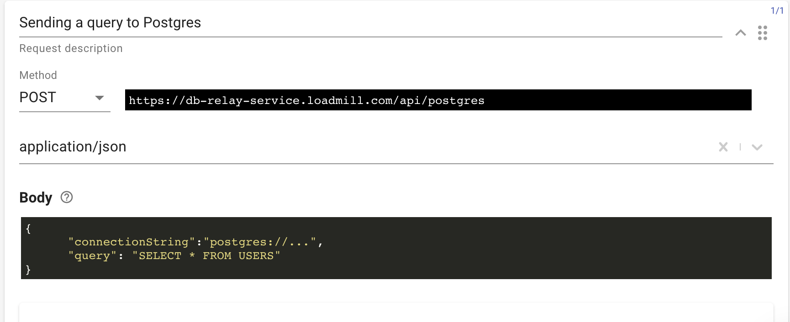

# Loadmill DB relay service

Loadmill provides a service that allows users to execute various queries directly to their DB in order to validate data.

## Usage

### Postgres

To execute a query:

1. Go to a relevant test flow within a Test Suite.
2. Select "POST" as request Method, put URL - `https://db-relay-service.loadmill.com/api/postgres`
3. Choose "application/json" as Content-type.
4. Put the request body with the following structure:

```text
body: {
  connectionString: 'postgres://...',
  query: 'SELECT NOW()'
}
```

See a request example below:



By running the request, you will get a response in JSON format. 

### MongoDB

Execute queries directly to MongoDB:

`https://db-relay-service.loadmill.com/api/mongo`

```text
body: {
  connectionString: 'mongodb://...',
  collection: 'bios',
  command: 'find',
  query: { "awards.award": "Turing Award" }
}
```

### Redis

Execute queries directly to Redis:

`https://db-relay-service.loadmill.com/api/redis`

```text
body: {
  {
    connectionString: "redis://...", 
    command:"get | hget | hgetall",
    key:"any-key",
    field: "any-field"
   }
}
```

## DB relay service static IPs

Sometimes, executing queries to your env DB may require VPN. You can easily avoid this by whitelisting the DB relay service static IPs: \[52.42.51.230, 54.190.108.53\] in your firewall.

## Docker image

You can also use a docker image for DB relay service to deploy it in a specific environment of yours, find more information [here](https://hub.docker.com/r/loadmill/db-relay-service).

