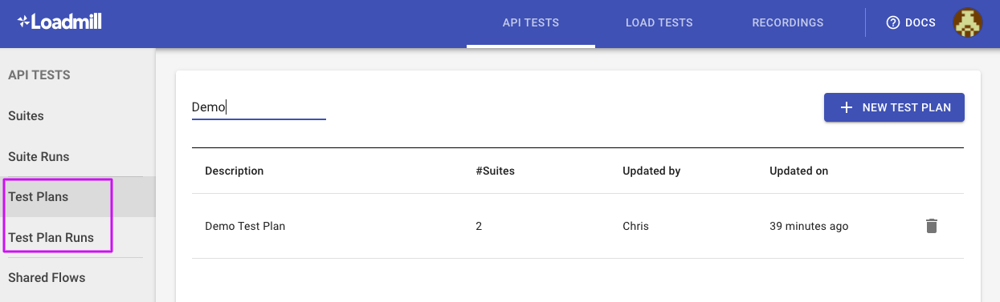
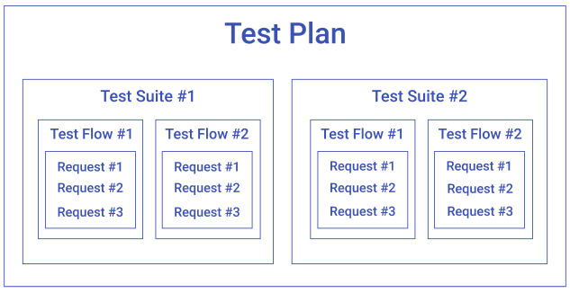
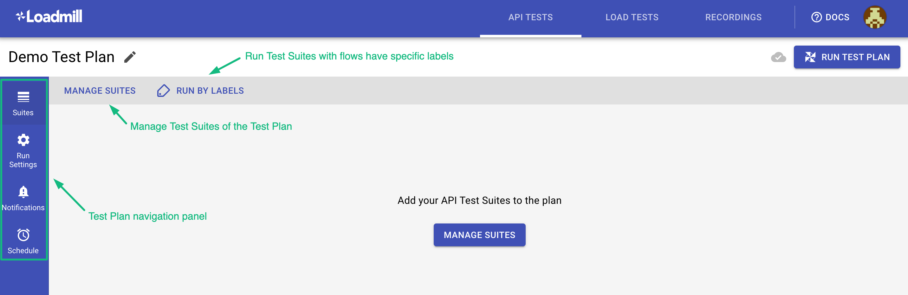
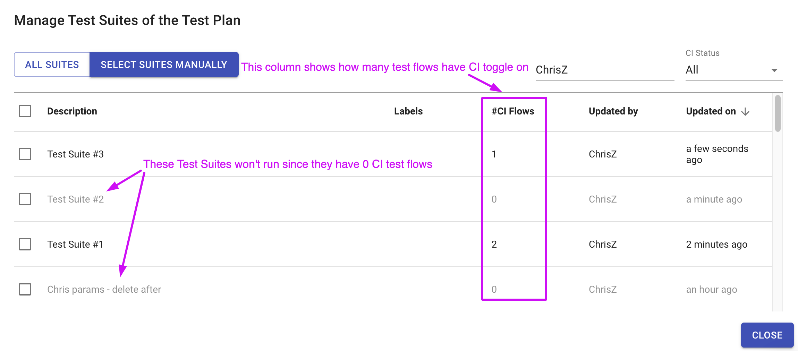
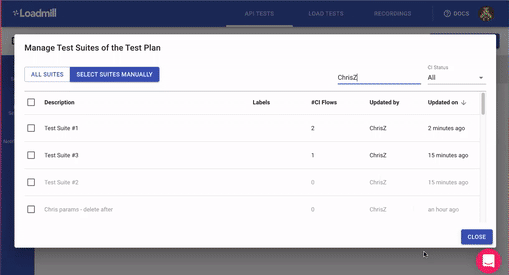
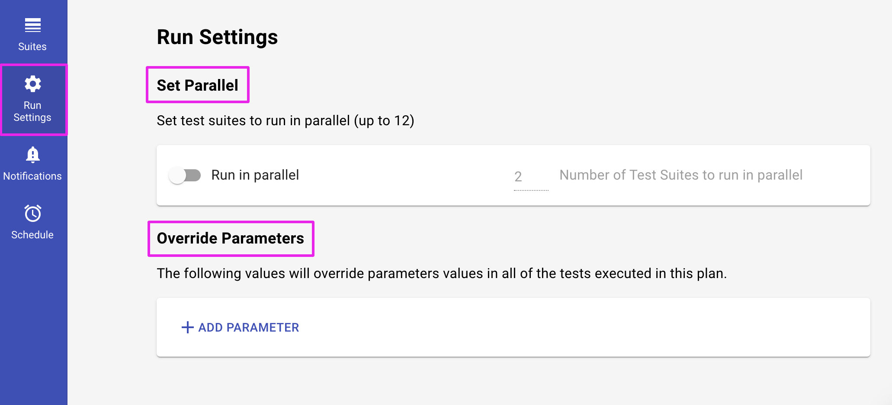
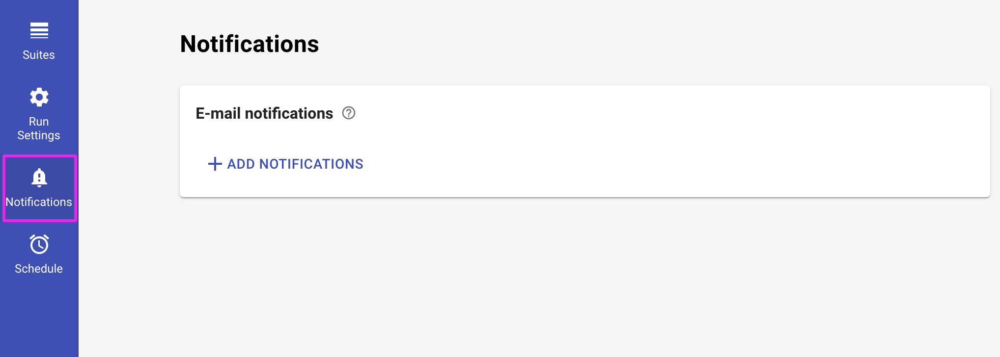
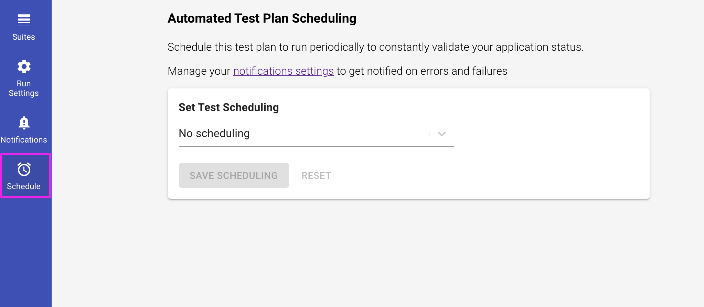
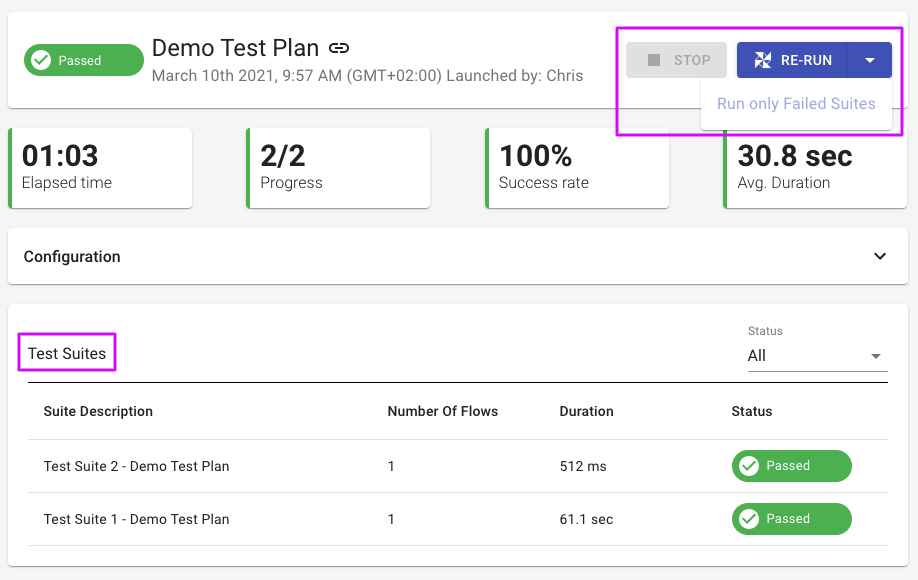

# Test Plan

A Test Plan is a collection of Test Suites that belong to specific tasks or features or have another reason to be run together. In general, the primary use of Test Plans is running several Test Suites integrated into your Continuous Delivery pipeline, although you may still run it manually in the UI.



The image below shows the Test Plan hierarchy in Loadmill. 



### Creating and running a Test Plan

Let's create and run your first Test Plan together:

1. Navigate to the Test Plans tab and click on the "NEW TEST PLAN" button.
2. Let's look at the Test Plan editor page.



   3. Click on "MANAGE SUITES" to add Test Suites to the Test Plan. You can pick specific Test Suites or all by clicking "ALL SUITES". Once the Test Suites are selected, click "CLOSE".


🧠 Make sure the Test Suites you would like to run within the Test Plan have test flows with CI toggle on. Otherwise, the Test Suites will be grayed out and won't run. 




 4. Now you have two options:

* Run the Test Plan by clicking “RUN TEST PLAN”  
* Use the "RUN BY LABELS" option to select relevant labels and then click “RUN TEST PLAN” so that only Test Suites whose test flows have specific labels will run.



### Test Plan navigation panel 

The panel allows:

1. To configure Test Plan parameters values so that the Test Plan run will include these values in **all the Test Suites using the parameters**.
2. To set Test Suites to run in parallel \(up to 12\) hence you will be able to significantly save running time.



    3. To configure the Test Plan e-mail notifications so that you will get one email with all the Test Suites' information.



    4. To schedule the Test Plan to run periodically to constantly validate your application status.



### Integrating Test Plan into CI/CD

To integrate Test Plans into your Continuous Delivery pipeline, use our npm module. See an example of how to launch a Test Plan below:

```text
loadmill --test-plan <test-plan-id> -w -v -t <token> --report --colors
```

Find more examples and supported CLI options [here](https://www.npmjs.com/package/loadmill).

### Analyzing Test Plan results

After running the Test Plan, you will be redirected to the Test Plan Run page. The Test Plan Run report page shows the list of executed Test Suites as defined in the Test Plan. The Test Suites table shows **each suite's description, the number of its flows, duration, and status**. Use the table filter to filter the Test Suites by their status.



You can easily re-run Test Plan by clicking **RE-RUN** or **Run only Failed Suites**. 

