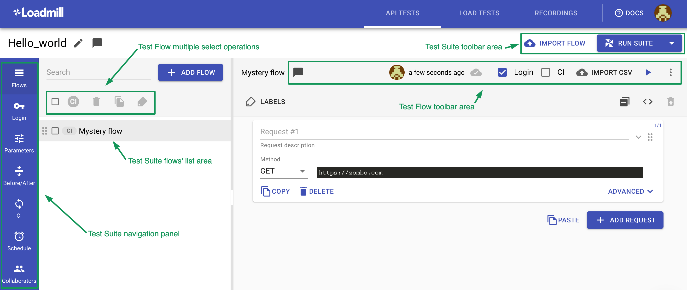

# Test Suite editor

A Test Suite is a collection of Test Flows that belong to specific tasks or feature, or have some other reason to be run together. When executed, if one of the flows fails, the Test Suite run will fail.

Let's take a look at the Test Suite page.

The Test Suite's navigation panel includes 7 tabs: **Flows, Login, Parameters, Before/After, CI, Schedule and Collaborators.**

| Tab | Description |
| :--- | :--- |
| Flows | The first and the most important tab where you write your flows.  |
| Login | Easily configure [the global login flow](https://docs.loadmill.com/api-testing/test-suite-editor/global-login-flow) that will run before each test flow of the Test Suite. |
| Parameters | Set [default parameters](https://docs.loadmill.com/api-testing/test-suite-editor/parameters) that will be used in the Test Suite.  |
| [Before/After](https://docs.loadmill.com/api-testing/test-suite-editor/before-and-after-hooks) | Configure a setup and teardown logic for your Test Suite. |
| CI | Integrate a Test Suite into your CI/CD process and run API tests via REST, CLI or JavaScript. |
| Schedule | Schedule the Test Suite to be run periodically to constantly validate your application status. |
| [Collaborators](https://docs.loadmill.com/collaboration/test-suite-collaborators-1) | Set team members who will be able to edit the Test Suite. |

#### 

#### 

#### 

#### 

#### 

#### 

#### 

