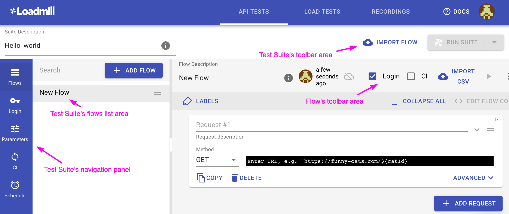

# Test Suite editor

A Test suite is a collection of Test Flows intended to run together. When executed, if one of the flows fails, the test suite run will fail.

Let's take a look at the Test Suite page.

