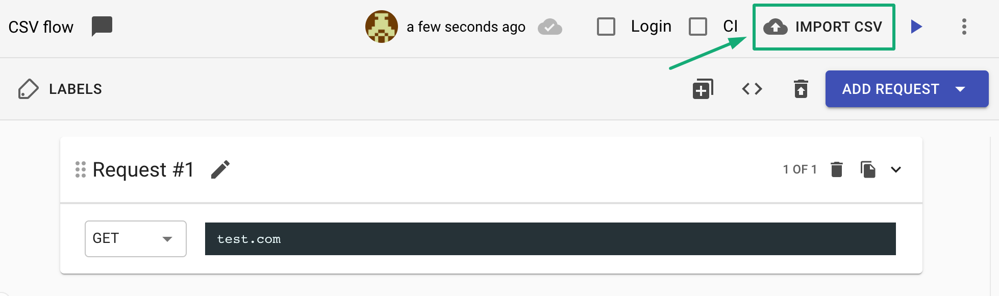
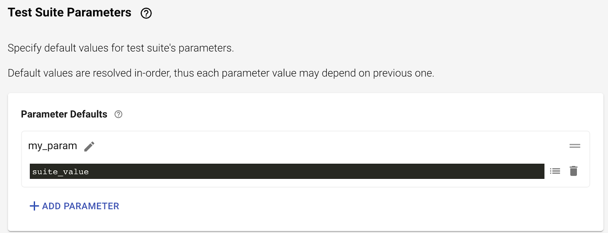
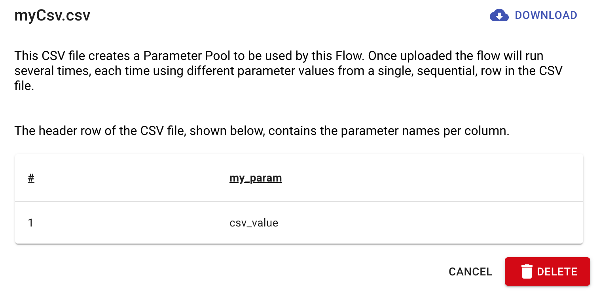
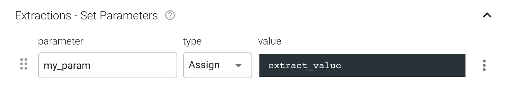

# API Tests - Data from CSV files

When you wish to run a flow several times using different parameters values for each run - just use a CSV file to list the parameters values and on run time the flow will run as the number of rows in the CSV, each run will get it’s own row values from the CSV file.

Find the "Import CSV" in the flow upper toolbar:

Once the CSV file has been uploaded, you will be able to go over the different parameters and their values in a preview window, when you're done, just click "Upload". (Attention: in cases where the CSV file contains empty cells, Loadmill will not prevent its uploading).

When a flow is using a CSV file, there will be an indication "Using CSV".

In order to remove a CSV file from the test, simply click on the "Using CSV" button, and click on the "Delete" button.

**Iteration for each CSV value**

When running a test suite using a CSV file, the flow using the CSV will run for a number of iterations as the number of values in the CSV, **each iteration with the next values defined in the CSV file**.

### Execution Order

When using a parameter defined in a CSV file, any parameter defined in the "Test Suite Parameters" tab **will be overridden by the value given from the CSV file**.

The order of parameter value assignment is:

1. Value as in **Test Suite Parameters tab**. For example:

   2\. Value as they appear in the **CSV** file. For example:

     3\. Value as defined in the **Extractions - Set Parameters **section of specific request (This will override all of the above). For example:

