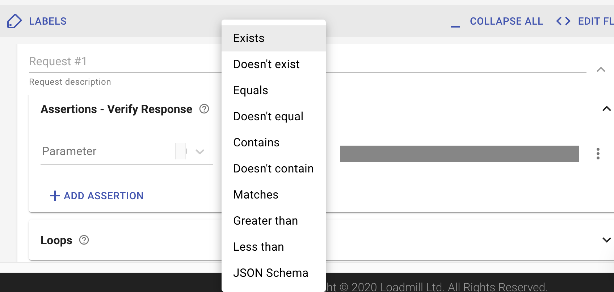
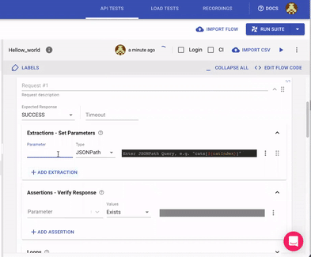

# Assertions - Verify Response

When testing an API, it is usually not enough to verify that all our HTTP requests completed successfully. Often, it is necessary to make sure that we got the correct response from the server by examining the **response status, body or headers**.

With [Loadmill](https://www.loadmill.com), this is made easy by using **Assertions**. Assertions are used in conjunction with [parameters](parameters.md) to do just that: examine the server's response and assert its correctness.

You may have an arbitrary number of assertions executed after each successful request. If an assertion fails, the next request will **not be executed** and the test scenario will be marked as **failed**, but the subsequent assertions for the current request **will be executed** nonetheless.

## Assertion Types

The target of an assertion is always a parameter value. You may use built-in parameters, default parameters or any parameter extracted from the current or previous requests in the **current scenario** as the target.



There are several types of assertions:

1. **Exists** - the target exists.
2. **Doesn't exist** - the target doesn't exist.
3. **Equals** - the target is equal to the given expression. The equality check is **case sensitive**.
4. **Doesn't equal** - the target is NOT equal to the given expression. The equality check is **case sensitive**.
5. **Contains** - the target contains the given expression. The containment check is **case sensitive**.
6. **Doesn't contain** - the target DOESN'T contain the given expression. The containment check is **case sensitive**.
7. **Matches** - the target matches the given regular expression.
8. **Greater than** - the target is greater than the given expression.
9. **Less than** - the target is less than the given expression.
10. **JSON Schema** - the target matches the JSON Schema.

You may embed parameters in any assertion expression. These parameters will be evaluated right before the assertion is executed.

See **an example of the assertion** that validates the generated ID is in [the format of UUID](https://docs.loadmill.com/api-testing/test-suite-editor/functions#__is_uuid-target) below:




🧙♂ When creating tests via [our Chrome recorder extension](https://docs.loadmill.com/getting-started/getting-started#creating-and-running-an-api-test-by-using-our-chrome-recorder-extension), Loadmill creates **two automatic assertion types** for you: 

1. Default assertions - for any extraction we find in the recorded test, we add a default assertion to it.
2. Specific assertions - for any parameter with given user key \(for example, "success"\) we extract it and assign to it an assertion \(example: "success" equals "true"\).



## Caveats

Keep in mind that all parameter values are **textual**, i.e. a parameter has **no type** such as `Number` or `Array` that we know from common programming languages.

This is important in order to avoid confusion when using parameter extractors such as **JSONPath**. For example, consider the following scenario:

1. Extract the value for `books` via the JSONPath query `student.books` on

   ```javascript
    {
        "student": {
            "books": []
        }
    }
   ```

2. Assert `books` is **Not Empty**.

You may expect this assertion to fail but, in fact, it will succeed. This is because the parameter `books` is evaluated to `[]` and therefore is considered as a non-empty string. One possible way to correct this is to use a **RegExp** assertion on the `books` parameter instead: `\[[^\s]+\]`.

