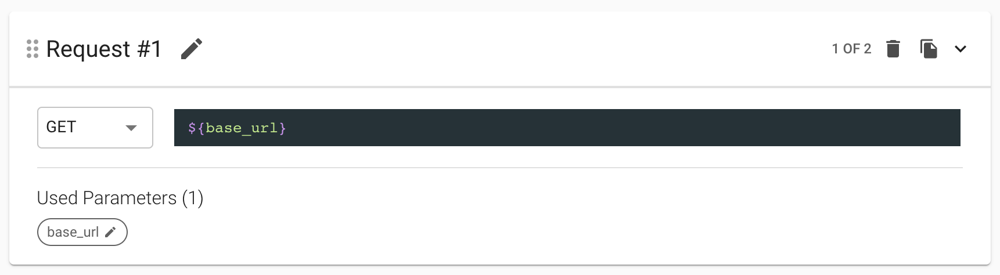
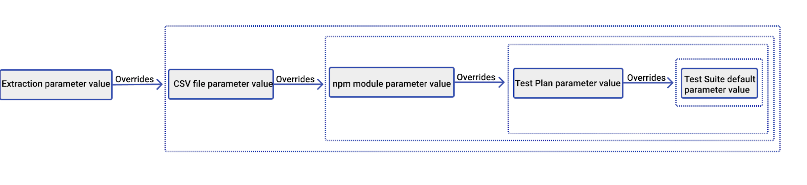
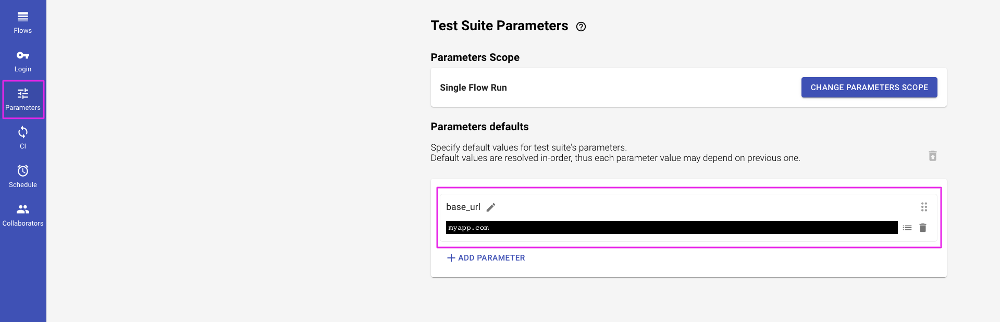
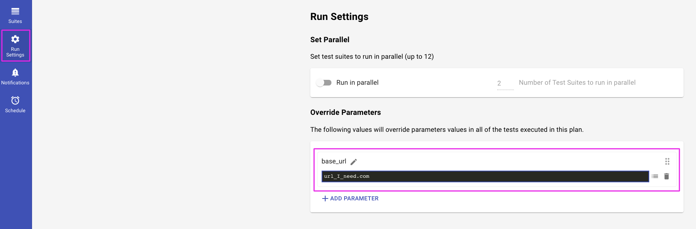
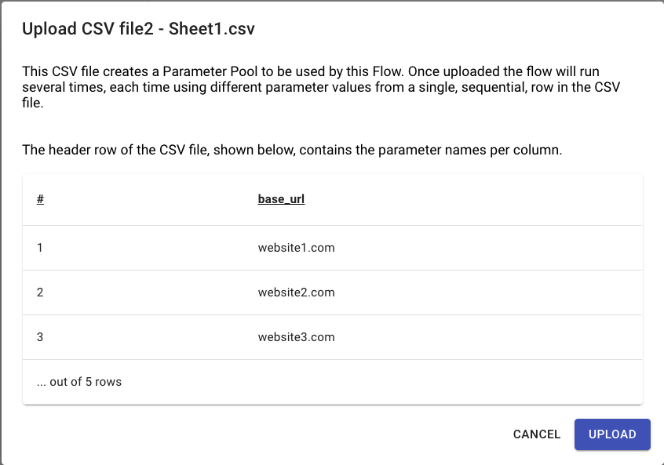

# Parameter Execution Order

When using parameters in Loadmill tests, it is important to understand their hierarchy. To figure it out, let's look at a basic example below:

The user has a test flow with a GET request to his application home page.



The "base_url" parameter is used to store URLs and choose them depending on which environment the user would like to run tests against. This parameter can be defined by several ways, let's review them:



1. **Test Suite Parameters tab** - this is a place where the user defines a default value for the parameters he is going to use in the Test Suite. In our case - "base_url".



  2\. **Test Plan parameter value** - once the user has a few Test Suites, he groups them into a higher level called [Test Plan](https://docs.loadmill.com/api-testing/test-plan) per a specific task or feature they belong to. Then, the user can configure the "base_url" parameter value that will be sent to all Test Suites during the Test Plan run. This value will override the value from the Test Suite Parameters tab (if there is any). 



  3\. **npm module parameter value** - when running tests in CI/CD, the user initiates their execution by using [our npm module](https://www.npmjs.com/package/loadmill) and he can add a relevant "base_url" parameter value to the command and **this value will **be taken for the run and **override the parameter value set in #2 and #1 above **(if there is any)**.**

```
loadmill  <test-plan-id> --test-plan -w -v -t <token> --report base_url=your_current_url
```

  4\. **CSV file parameter value** - in some cases the user may need to run the same request multiple times using different parameter values, so he can use a [CSV file for that](https://docs.loadmill.com/api-testing/test-suite-editor/api-tests-data-from-csv-files).



**The value from the CSV file will **be taken during the test run and **override the parameter value from sections above **(if there is any).

   5\. **Extraction parameter value** - when the user extracts value into a parameter within the request's [Extractions - Set parameters](https://docs.loadmill.com/api-testing/test-suite-editor/set-parameters-extractions) section, **this value will override the parameter value from all sections above during the test run**. 
