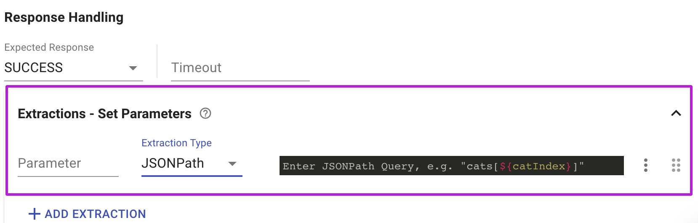

# Extractions - Set Parameters

Use the **Extractions - Set Parameters** section of the request to extract values from the responses. These extracted values can be use in any of the following requests or to assert and verify your success criteria. 

### Extraction Types

#### Assign

Use this to assign any combination of existing parameter or response values to another parameter

#### JSONPath

Use this extractor to extract values from JSON responses. JSONPath is a query language for JSON objects, much like XPath for XMLs.

You can test your JSONPath expressions using this useful online tool - [link](https://jsonpath.com/) and see some great examples on this page - [link](https://goessner.net/articles/JsonPath/index.html#e2)

#### jQuery

Use this extractor to extract values from HTML or XML responses. jQuery extraction syntax is very similar to XPath and may be very useful to extract values from HTML pages \(such as [security tokens](https://portswigger.net/web-security/csrf/tokens)\).

#### RegExp

Use this extractor to extract values from any type of response using RegExp. The first value captured by the regex \(in parentheses\) will be set as  the parameter's value. You can test your regex expressions using this useful online tool - [link](https://regex101.com/)

#### Header

Use this extractor to extract values from any of the response headers. 

