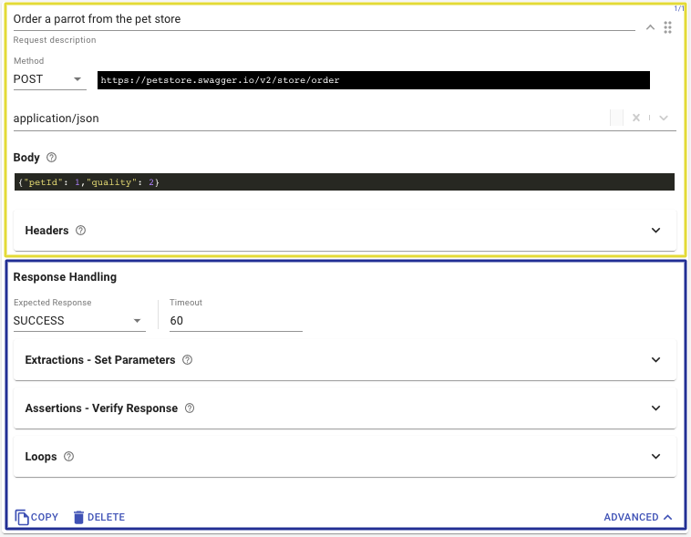
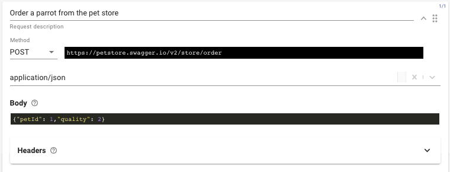
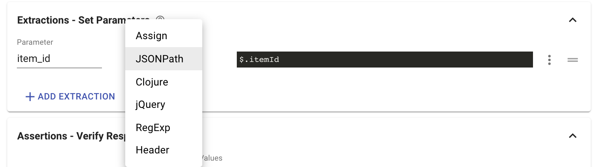
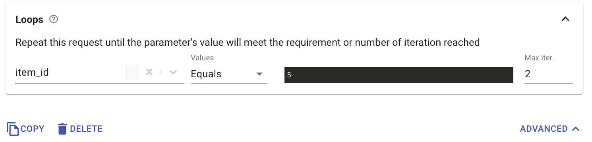

# Request editor

Request is the most basic building block of tests. It represents a single API call or a user action.

### Request sections

When we expand the request editor by clicking the ADVANCED button, we can see that a test request includes two sections - The **request main section** \(In yellow\) and the **response handling section** \(In blue\).  

#### The Request main section

* The **Method** and **URL** fields are the most basic requirements for a valid request.
* Black input fields are fields in which you can use [parameters](https://docs.loadmill.com/api-testing/test-suite-editor/parameters) and [functions](https://docs.loadmill.com/api-testing/test-suite-editor/parameters/functions).
* It is recommended to set the **Request description** in a way that describes its action. This will make it easier for you to debug your tests later if this request fails.
* Some requests requires a **body**. Selecting the right **content-type** for your request body will help us highlight the syntax of your request body \(i.e. JSON or XML\)

#### The Response Handling section

The response handling section enables to you extract values from the request's response and validate them.

The **Extractions - Set Parameters** card allows you:

* To extract values from the response body into an existing or a new parameter using JSONPath, Closure, jQuery, RegExp.
* To extract an HTTP header value into a parameter using the Header extractor.
* To assign a static value or apply a function on anther parameter using the "Assign" option.

Find more information about the **Assertions - Verify Response** card [here](https://docs.loadmill.com/api-testing/test-suite-editor/parameters/assertions). 

The **Loops** card allows to repeat the request until the parameter's value will meet the requirement or number of iteration reached:

