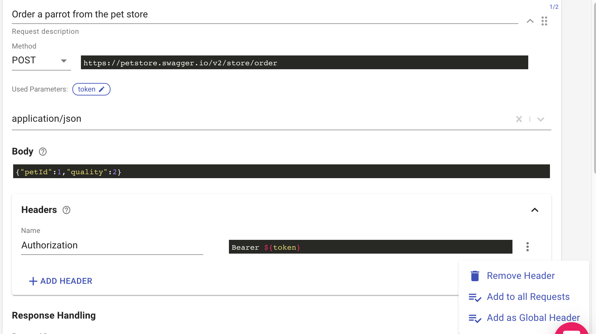
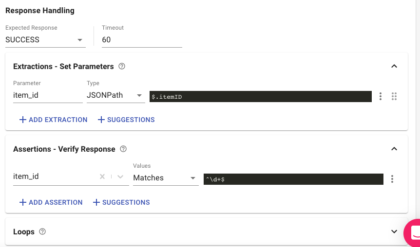
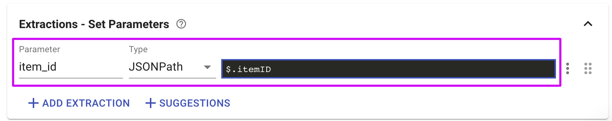
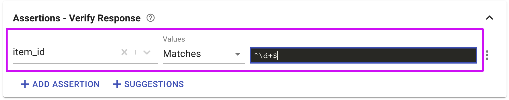

# Request editor

Request is the most basic building block of tests. It represents a single API call or a user action.

## Request sections

When we expand the request editor by clicking at the top-right of the request, we can see that a test request includes two sections - **Request and Response Handling sections**.  

### The Request main section

* The **Method** and **URL** fields are the most basic requirements for a valid request.
* Black input fields are fields in which you can use [parameters](https://docs.loadmill.com/api-testing/test-suite-editor/parameters) and [functions](https://docs.loadmill.com/api-testing/test-suite-editor/parameters/functions).
* It is recommended to set the **Request description** in a way that describes its action. This will make it easier for you to debug your tests later if this request fails.
* Some requests requires a **body**. Selecting the right **content-type** for your request body will help us highlight the syntax of your request body \(i.e. JSON or XML\).
* The **Headers** card allows to see and set the request headers. You can add a header to all requests or as a Global Header so that it will be added to all of the test flow requests and appear in [the Global Login tab](https://docs.loadmill.com/api-testing/test-suite-editor/global-login-flow).

### The Response Handling section

The response handling section includes 3 cards: **Extractions - Set Parameters, Assertions - Verify Response and Loops.** It ****allows you to extract values from the request's response and validate them.

#### The **Extractions - Set Parameters** card allows you:

* To extract values from the response body into an existing or a new parameter using JSONPath, Closure, jQuery, RegExp.
* To extract an HTTP header value into a parameter using the Header extractor.
* To assign a static value or [**apply a function on another parameter**](https://docs.loadmill.com/api-testing/test-suite-editor/functions) using the "Assign" option.
* To add an extraction from [the Suggestions repository](https://docs.loadmill.com/api-testing/test-suite-editor/set-parameters-extractions#suggestions). Team admins configure the repository within Settings - Suggestions.

The **Assertions - Verify Response** card allows you to validate the request response, find more information [here](https://docs.loadmill.com/api-testing/test-suite-editor/parameters/assertions). 

The **Loops** card allows to repeat the request until the parameter's value will meet the requirement or number of iteration reached:

