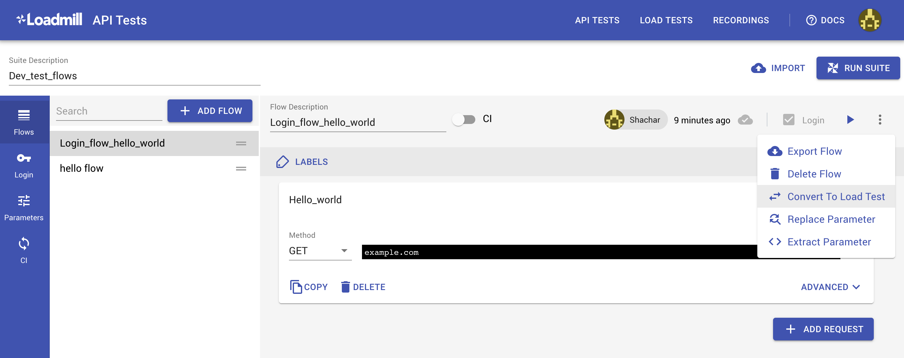
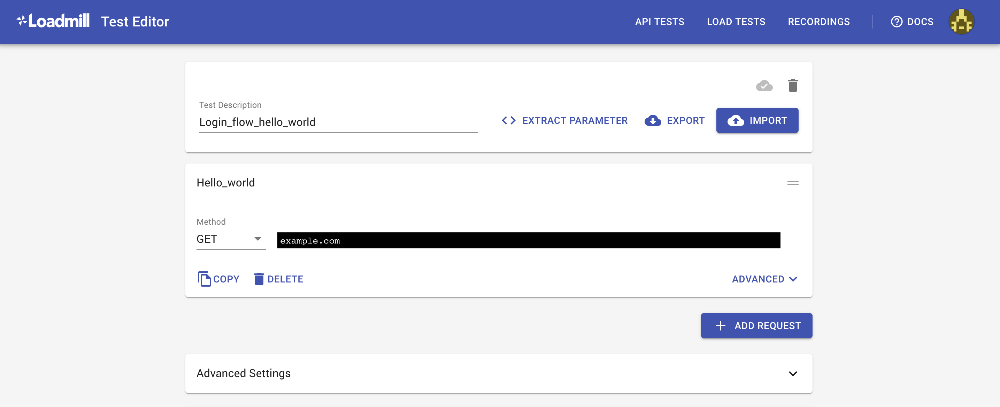

# Test Flow editor

API Test flow is a series of API calls \(HTTP requests\) that represent a single "user" flow we would like to test. These requests will be executed sequentially until completion or until the first failure.

### The Test Flow toolbar

#### **Run Flow button** \(▶\)

Run the edited flow as a "Dry run" to debug and validate it.

#### **Export Flow**

Save the flow to a `.JSON` file. You can then import the flow into another test suite or as a load test.

#### **Replace parameter**

Replace the usage of a parameter in this flow with another parameter \(Parameters will be discussed later in depth\) 

#### **CI toggle**

Toggle this switch to enable the flow to run when executed from your continuous integration pipeline. You can use our NPM module to execute a Test Suite to test every build in CI, this will be explained lated in the Integrations section.

### Other flow controllers

#### **Add Request button**

Add new requests to a flow. Once added you can drag a request to change its order by grabbing it at the top right corner. 

**Converting an API flow to a Load test**

Easily convert an API flow to Load test by clicking on the Flow options menu  located on the top right and select " "Convert to Load Test". Once you've selected "Convert to Load Test", a new Load test will open containing all the requests and properties taken from the original API test.

