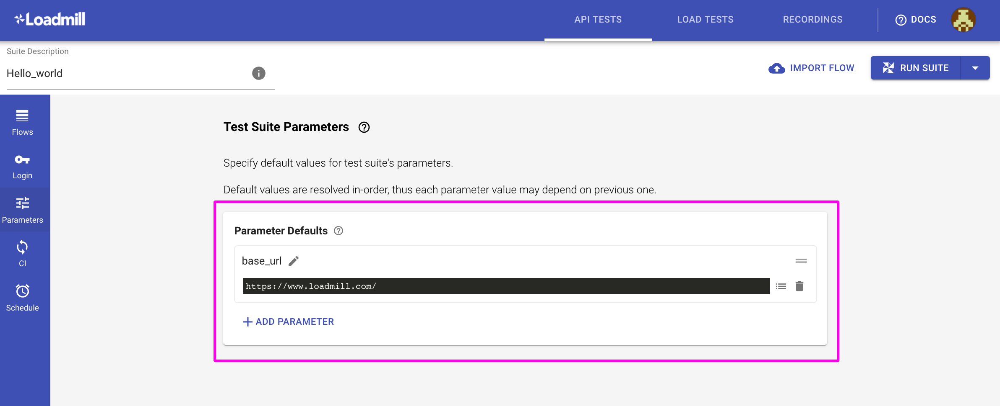
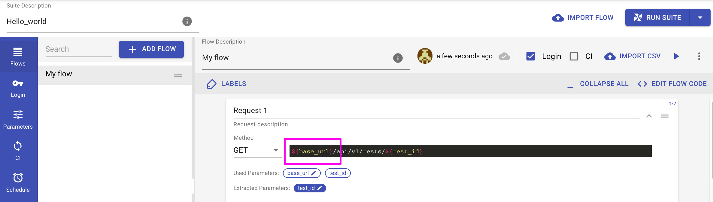

# Test Suite Parameters

The Test Suite Parameters tab allows to configure static \(default\) parameters which are relevant to the execution context. e.g. target host, login credentials, and user input. 

Static parameters can be used in requests using the template strings notation: `${parameter_name}`. 

