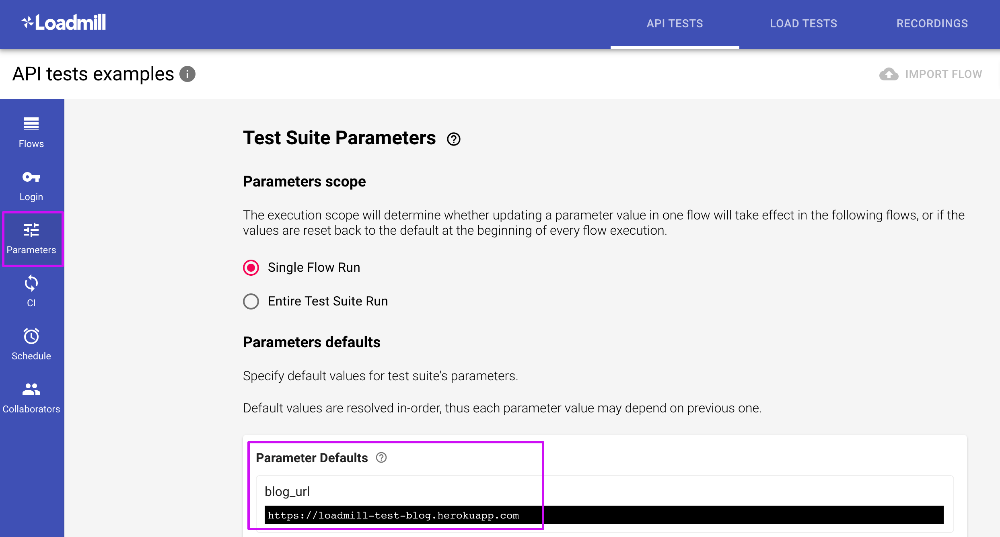
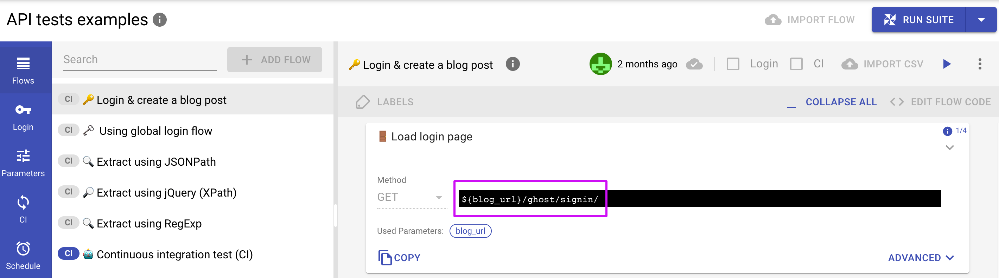
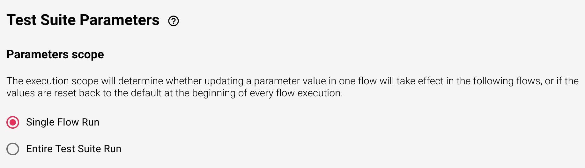

# Test Suite Parameters

The Test Suite Parameters tab allows to configure default parameters which are relevant to the execution context. e.g. target host, login credentials, and user input. 

Default parameters can be used in requests using the template strings notation: `${parameter_name}`. 

#### Parameters scope

By default, Test Suite parameters have the **Single Flow Run** execution scope. The alternative option is to select the **Entire Test Suite Run** scope. 

Look at the example below to better understand what the execution scope means. Let's say, I have a test flow where I test creating and editing a blog post. I've extracted ID of the post that has been created and now I want to use it in the following requests. This is a classic example of a self-contained test and It will work regardless of the execution scope selected. But in case I would like to use the post ID parameter in another flow of the Test Suite I should choose the "Entire Test Suite Run" scope.

