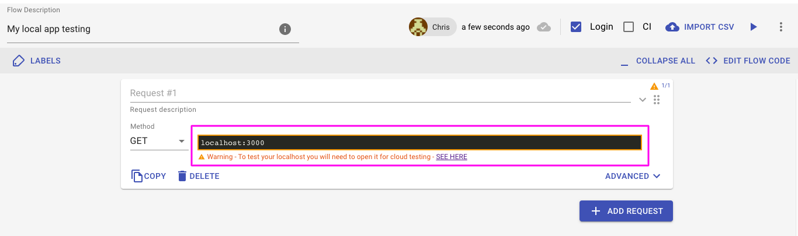
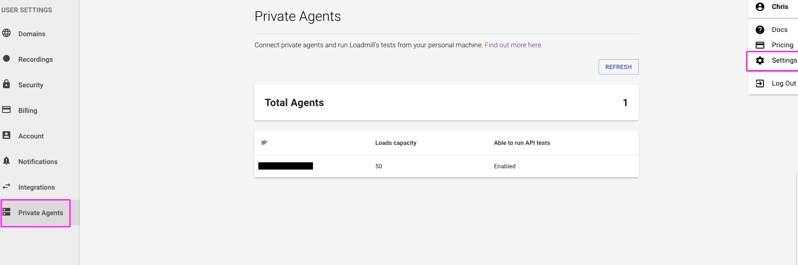

# 🕵🏻‍♂️ Loadmill Agent

Testing your local environment before publishing the changes helps identifying bugs earlier and speeds up development cycle.

## The problem

I want to test my app locally but getting a warning when trying to create a request:



When you try to reach localhost on your browser,  you are actually trying to connect to your local computer’s ip address, 127.0.0.1. This local IP address is the same for every computer. 

However, Loadmill is a SaaS \(software as a service\) company. That means that Loadmill’s web server runs on another computer somewhere in the world. Therefore, Loadmill.com will send an HTTP request to its own machine’s localhost ip address and not to your server, resulting in an error response. 

You can think of it this way: imagine you are on a vacation abroad, and you want to write a letter to your relatives back home. After you finished writing the letter, you would write on the envelope, “my home” as the target address. The mailman will not understand where to send the letter, of course. The mailman has his own idea of “my home”, but it is not your home, but rather, it’s his home. He will need your public home address in order to send the letter to your relatives. This scenario is equivalent to asking Loadmill \(the mailman\) to send an HTTP request \(the letter\) to localhost \(“my home”\).

## The solution

We recommend using our [**Loadmill Agent**](https://www.npmjs.com/package/@loadmill/agent) that allows you to run API and Load tests locally or even on your servers if you wish. 

### Setup

In order to use the Loadmill Agent you will need to generate an [API Token](https://docs.loadmill.com/integrations/api-tokens).

### Installation

Using npm:

`npm i @loadmill/agent -g`

Using yarn:

`yarn add @loadmill/agent -g`

### Running the agent 

#### CLI

Note that this requires the package in a .js file. To start running the agent:

`loadmill-agent start -t INSERT_TOKEN_HERE`

The start command accepts the following options:

* `--token` - \(REQUIRED\) can be retrieved [through the UI](https://docs.loadmill.com/integrations/api-tokens).
* `--loads-capacity` - \(default = 50\). Optionally you can supply the number of users this agent can simulate. It can be 0 in order not to run load tests.
* `--no-api` - can be supplied in order to run [Load tests](https://docs.loadmill.com/load-testing/getting-started) only, [API tests](https://docs.loadmill.com/api-testing/getting-started) will run on Loadmill servers.
* `--config` - alternatively, you can supply a path to a yaml file that will contain all the options above.

**Extended Example**

`loadmill-agent start -t INSERT_TOKEN_HERE --no-api --loads-capacity 80`

`loadmill-agent start --config /path/to/config.yml`

#### Programmatically

Start running the agent:

```text
// Start the agent 
const {start} = require('@loadmill/agent');
const stop = start({
  token: 'INSERT_TOKEN_HERE',
  // loadsCapacity: 80,
  // api: false
});
// Stop the agent by calling the stop function
stop();
```

That's it! 🎉 From now on, tests you are running in Loadmill will run locally or on your server \(depends on where you configured them to be run\) as long as our Loadmill Agent is running. 

You can also use the Loadmill agent docker wrapper, find more information [here](https://hub.docker.com/r/loadmill/agent).

See agent/s running within the **Private Agents** tab in Loadmill:



#### Working with insecure certificates

In case you are testing a system that uses https but has a self-signed or invalid SSL certificate, you need to set env var - `NODE_TLS_REJECT_UNAUTHORIZED=0`  at the beginning of the start command to run your tests via the Loadmill Agent. **IMPORTANT:** The Loadmill agent won’t be able to verify that it is talking to the right website in this case.


