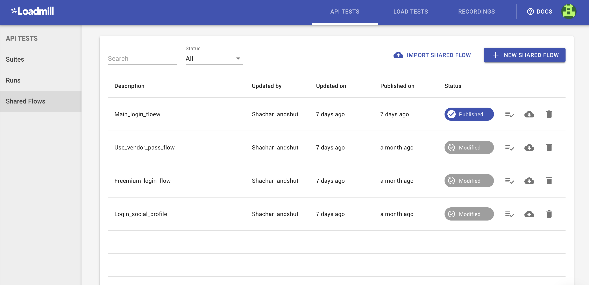
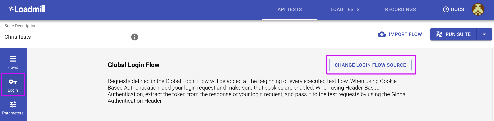
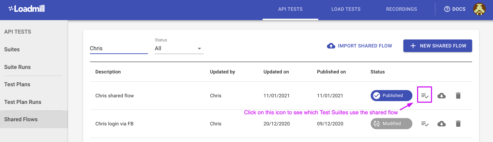

# Shared Flows

The **Shared Flows** feature allows users to re-use test flows in different Test Suites. 


This feature can be enabled per request. Just click on the bubble chat button in the lower-right corner of the screen or drop us a line at support@loadmill.com.

Once enabled, team admins can utilize it. 


The common use case for Shared Flows is when you have several login test flows. For example, the email/password login that should be used in some Test Suites and the login via a social media platform that should be used in others. To configure this in Loadmill:

* Navigate to **API TESTS =&gt; Shared Flows**

* Click on the "+ NEW SHARED FLOW" button if you would like to create a login flow from scratch OR "IMPORT SHARED FLOW" in case you already have it in JSON format.
* We recommend using the "DRY RUN" option first to test your flow and then Publish it. 
* Now you can go to the Test Suite where you would like to use it - the Login tab - click "CHANGE LOGIN FLOW SOURCE" and select your shared flow. 

Thus, the shared flow will run before each test flow of the Test Suite. You can create several shared flows according to your use case.

By the way, you can always track which Test Suites using your Shared Flows. 

