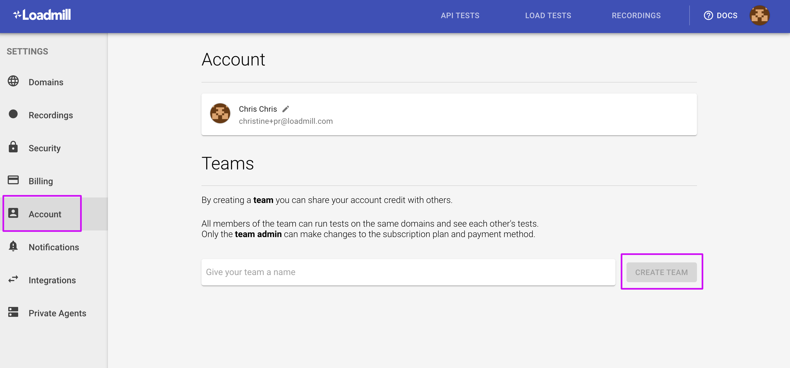

# Teams

The **Teams** functionality in Loadmill allows all the team members to share the account credit, see each other's tests and run them on the same domains.

Navigate to **Settings => Account => Teams** to create a new team. 

Once you've created a team, click the "ADD MEMBER" button to add more team members.


:man_mage: Adding more team members is available on [paid plans](https://www.loadmill.com/#pricing).


There are **two user roles** in Loadmill: **admin **and** member**. All members of the team can run tests on the same domains and see each other's tests. Only the team admins can make changes to the subscription plan, payment method, [Recordings settings](https://docs.loadmill.com/working-with-the-recorder/recorder-settings) and configure Integrations.

By default, a new user can create a new team unless he has already been added to one. 

To join another team, the user should ask the admin of this team to add him to it (unless the team's subscription plan is not Free hence the user should be removed by the admin of the "old" team first in order to join the "new" team.

By the way, users can also change their display names within the "Account" tab.

