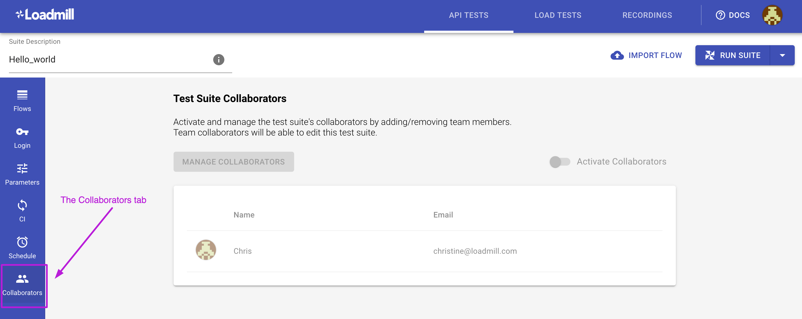

# Test Suite Collaborators

The **Collaborators** tab within the Test Suite allows users to protect the Test Suite so that **only** team members who are set as collaborators and team admins will be able to edit it. 

The meaning behind this feature is to make sure only relevant team members are able to modify the Test Suite, prevent working on the same Test Suite and running over each-other's work.

**Important notes:**

* By default, the Test Suite Collaborators feature is disabled and only team admins can activate/deactivate it within the Collaborators tab.
* The author of a Test Suite is automatically added to collaborators once the Test Suite got created but he can't activate or manage collaborators within it in case he is not a team admin.
* Once the Collaborators feature is activated, the Test Suite collaborators can edit the Test Suite and manage collaborators within it. Team members who are not defined as collaborators will be able to view the Test Suite and perform the following actions: Copy request, Export flow & Suite, all types of run actions.
* Team admins can act as collaborators in all the team Test Suites \(even when not listed as collaborators\).

