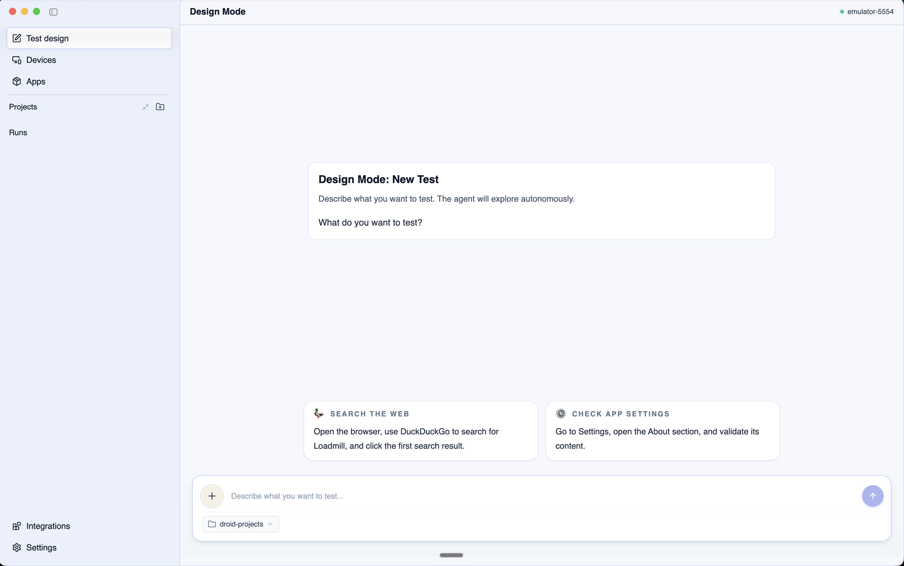
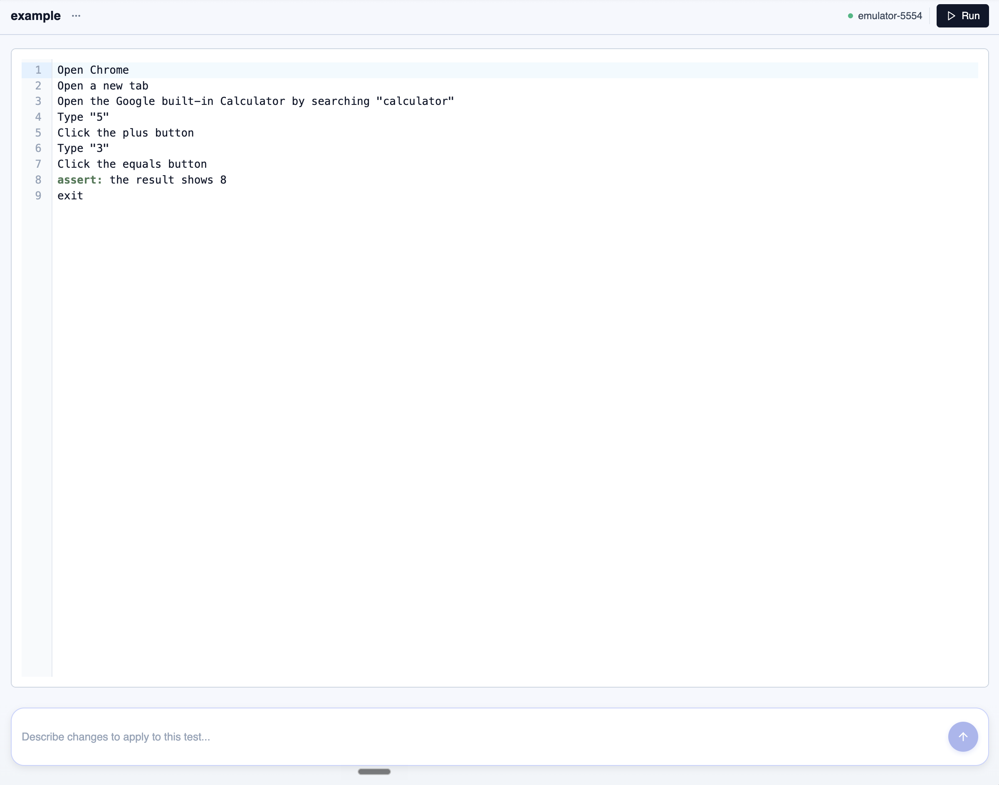

# Getting Started

This guide shows the basic path for running your first Droid CUA test.

***

## Before you start

You will need:

* The Droid CUA desktop app installed.
* A Loadmill account.
* A target device, simulator, cloud device, or browser.
* Android Debug Bridge (ADB) for Android testing.
* Xcode, Appium, and the XCUITest driver for iOS simulator testing on macOS.
* Chrome or Edge installed for web testing.

For a fuller checklist, see [Setup](setup.md).

***

## Step 1: Download the desktop app

Download the latest desktop app release:

* [Mac](https://github.com/loadmill/droid-cua-release/releases/latest/download/Loadmill-Droid-CUA.dmg)
* [Mac Intel](https://github.com/loadmill/droid-cua-release/releases/latest/download/Loadmill-Droid-CUA-intel.dmg)
* [Windows](https://github.com/loadmill/droid-cua-release/releases/latest/download/Loadmill-Droid-CUA-Setup.exe)

After the download finishes, install and launch Droid CUA.

***

## Step 2: Sign in

When the app opens, sign in with your Loadmill account.

If the setup wizard appears, follow the checks it shows. It helps confirm that the required tools for Android or iOS testing are installed.

***

## Step 3: Choose a target

Choose the platform you want to test.

For Android, connect a physical device with USB debugging enabled, or choose an available emulator.

For iOS, choose an installed iOS simulator. iOS simulator testing is available on macOS only.

For web testing, choose the web platform and use an installed Chrome or Edge browser.

For cloud mobile testing, use the CLI with LambdaTest credentials and a mobile app build.


***

## Step 4: Create a project

Create or open a Droid CUA project and choose where to store your test files.

Droid CUA tests are saved as `.dcua` files. Keeping them in your project repository makes it easy to review, edit, and run them later in CI.

You can also choose a results folder. This is where Droid CUA stores run reports and execution history.

***

## Step 5: Write a simple first test

Start with a short flow that is easy to verify.

For example:

```
Open the app.
Sign in with the standard test account.
Verify that the Home screen is visible.
```

Good Droid CUA instructions describe the user's goal and the visible result. Use the exact button names, screen names, and messages that appear in your app when possible.

You can write a test directly, or use Design Mode to describe what you want to test and let the agent create a first draft.



Saved tests are plain `.dcua` files. They are easy to read, review, and run again later.



***

## Step 6: Run and review

Run the test from the desktop app and watch the live execution log.

If the test fails, look for the first place where the agent did something different from what you expected. Then update the instruction, add clearer app context, or split the flow into a smaller test.

For the first few tests, keep each flow small. Once the device connection, credentials, and app context are working, you can add broader scenarios.

If the problem happens before the test starts, see [Setup troubleshooting](setup-troubleshooting.md).
