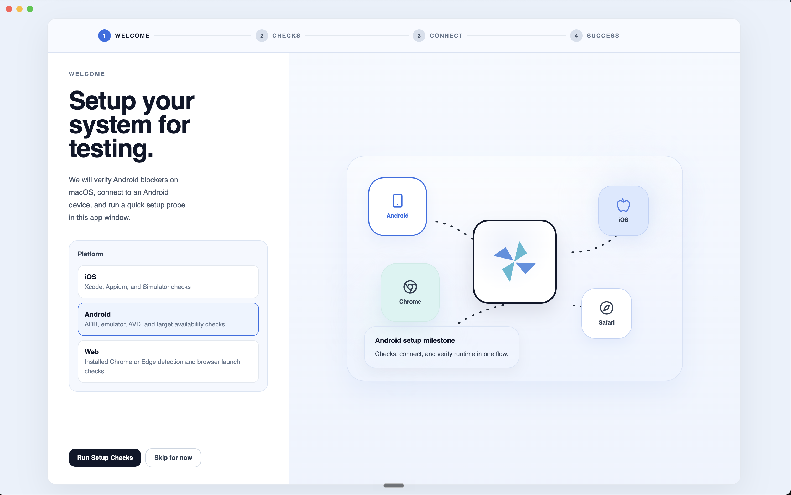
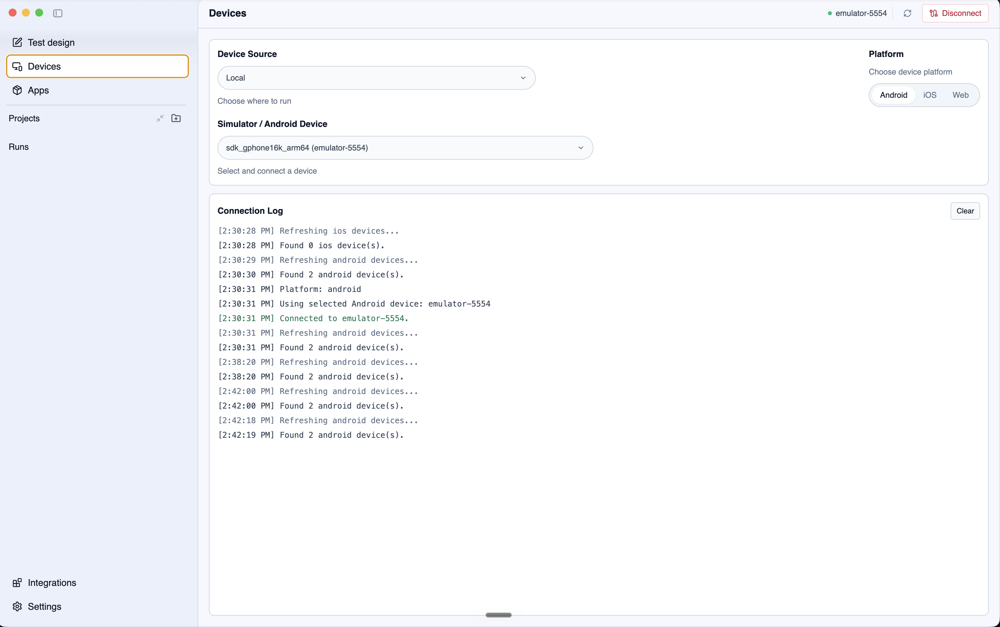
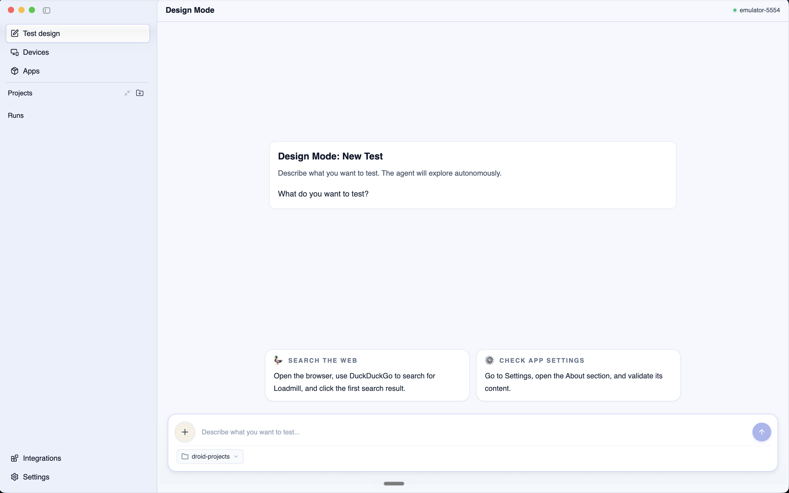
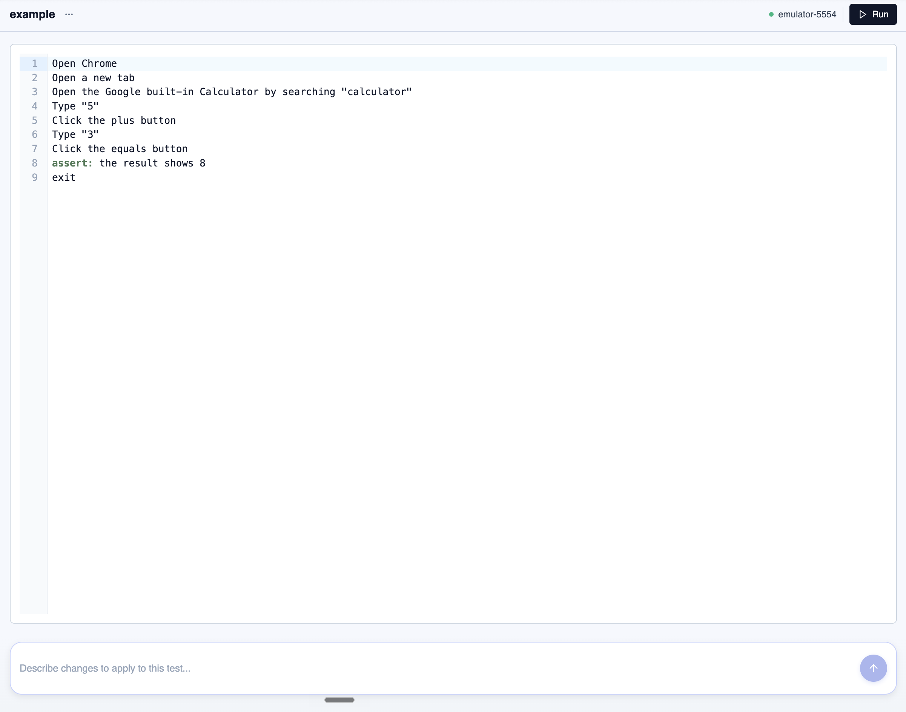

# Droid Mobile Testing Quickstart

This is the A-to-Z guide for running your first Droid test. It takes you from installing Droid CUA to saving and reviewing the result. By the end, you will have a connected target, a project with shared app context, a focused `.dcua` test, and a result you can review in the desktop app and Loadmill.

***

## Before you start

You will need:

* A [Loadmill account](https://app.loadmill.com/app/signup).
* The [Droid CUA desktop app](https://www.loadmill.com/mobile-testing-agent).
* An app or website you are allowed to test.
* A target: an Android device or emulator, an iOS simulator on macOS, or Chrome or Edge for web testing.
* A stable internet connection. Droid uses Loadmill's cloud service while it runs.
* The platform tools required for your target. The setup wizard will check these for you.

For the complete platform requirements, see [Setup](setup.md).

***

## Install Droid CUA and sign in

Download the desktop app from the [Loadmill Mobile Testing Agent page](https://www.loadmill.com/mobile-testing-agent), or use a direct installer:

* [Mac](https://github.com/loadmill/droid-cua-release/releases/latest/download/Loadmill-Droid-CUA.dmg)
* [Mac Intel](https://github.com/loadmill/droid-cua-release/releases/latest/download/Loadmill-Droid-CUA-intel.dmg)
* [Windows](https://github.com/loadmill/droid-cua-release/releases/latest/download/Loadmill-Droid-CUA-Setup.exe)

Install and open Droid CUA, then sign in with your Loadmill account.

***

## Complete the setup wizard

The first time you open Droid CUA, the setup wizard prepares the computer and target. It has four stages:

1. **Welcome** — choose Android, iOS, or Web.
2. **Checks** — verify the tools Droid needs. Resolve any required check that fails, then retry it.
3. **Connect** — select a device, simulator, or browser and run the setup probe.
4. **Success** — continue to the app after Droid confirms the target is ready.



You can run the wizard again later from **Help**. For manual setup and troubleshooting, see [Setup](setup.md) and [Setup troubleshooting](setup-troubleshooting.md).

***

## Create your first project

Open **Projects**, select **New project**, and choose a folder in the application repository. A Droid project keeps the tests and shared product knowledge for one application together.

A simple project can look like this:

```text
tests/droid/
├── context.md
├── login.dcua
├── test-data.md
└── .secrets
```

Only `context.md` and the `.dcua` test are needed for a basic first run. Add `test-data.md` when the same journey needs reusable non-secret data, and add `.secrets` when it needs credentials. Keep `.secrets` out of version control.

***

## Start `context.md` while you create the test

You do not need to document the entire app before writing a test. Begin with the first journey and add shared knowledge as you discover what the agent needs.

From the project, select **Open app context**. If `context.md` does not exist, Droid can create a starter file with sections for the app overview, screens, actions, and business entities.

For a first login test, the context might begin with:

```md
# Overview

This is a mobile banking app. The main navigation appears at the bottom after sign-in.

# Screens

The home screen is titled "Accounts" and shows the signed-in user's account cards.

# Actions

After a successful sign-in, wait for the loading indicator to disappear before using the bottom navigation.
```

Keep information in the place where it will be most useful:

* Put steps for this journey in the `.dcua` test.
* Put reusable product knowledge in `context.md`.
* Put non-secret values that vary between runs in `test-data.md`.
* Put credentials and sensitive values in `.secrets`.

Continue refining the context as you build and run the test. See [Writing Reliable Droid CUA Tests](best-practices.md#build-context-alongside-the-test) for the full approach.

***

## Confirm the target

Open **Devices** and select the target prepared by the wizard.

* For Android, choose a connected physical device or emulator.
* For iOS, choose an installed simulator. iOS simulator testing is available on macOS only.
* For web, choose Chrome or Edge and select a persistent or fresh browser session.



If you are testing a mobile build that is not already installed, add the `.apk`, `.ipa`, or `.app` from the **Apps** page before starting the run.

***

## Create your first test

Choose a short, stable flow with an obvious result. Signing in and verifying the first screen is a good starting point.

The easiest way to draft the journey is **Design Mode**. Select the project so the agent can use its context, then describe the result you want:

```text
Sign in with the standard test account and verify that the Accounts screen is visible.
```



Design Mode explores the app and creates a draft `.dcua` file. Review the draft before saving it. A useful first test might read:

```text
Open the app and sign in with the standard test account.
Verify that the "Accounts" screen is visible.
```

For a web test, begin with a known page:

```text
navigate: https://example.test/login
Sign in with the standard test account.
Verify that the dashboard is visible.
```

You can also create and edit `.dcua` files directly. Each non-empty line is an instruction or assertion, and `//` starts a comment for human readers.



***

## Run the test and watch what happens

Start the test from the desktop app and follow the live execution log. Droid sees the current screen, chooses an action, executes it, and checks the updated screen before continuing.

If the run diverges from your intent, find the first meaningful difference:

* Clarify the instruction when more than one route is reasonable.
* Add reusable, non-obvious product knowledge to `context.md`.
* Fix the target or setup when the run never reaches the app.
* Stop and report a product regression instead of teaching Droid to work around it.

Do not rely on repeated retries. One unchanged rerun can confirm a temporary device or network problem, but ambiguous tests should be improved using the evidence from the run.

***

## Review the result

Open the completed run and review its screenshots and instruction timeline. A passing verdict is a starting point: also look for repeated typing, reopened screens, resubmitted actions, or other unexplained recovery.

Team members can review uploaded desktop and CI results from the [Droid Runs dashboard](runs-dashboard.md). It provides shared filters, trends, statuses, and links to detailed run reports.

***

## Next steps

Keep the first version focused on one coherent journey. Once it completes cleanly and its assertions prove the expected result, continue with:

* [Writing Reliable Droid CUA Tests](best-practices.md)
* [Common Droid Testing Mistakes](common-mistakes.md)
* [Set Up and Run Droid Web Tests](web-testing.md)
* [CLI](cli.md) and [Running Droid Tests in CI](ci.md)
