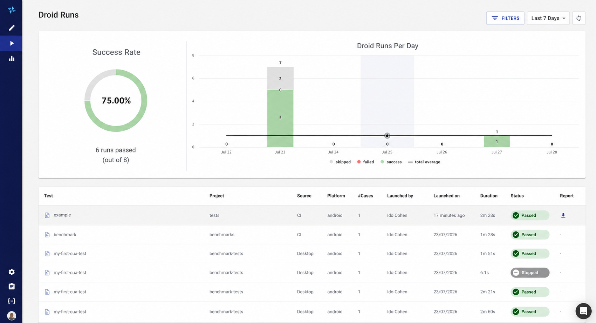

# Reviewing Droid Runs in Loadmill

The Droid Runs dashboard brings desktop and CI execution results into the Loadmill web application. Use it to review activity across projects, understand pass rates, find a particular run, and open the detailed report without access to the computer that launched the test.

Open [Droid Runs in Loadmill](https://app.loadmill.com/app/api-tests/droid-runs), or sign in to Loadmill and select **Droid Runs** from the main navigation.

***

## Understand the dashboard

The top of the page summarizes the selected period:

* **Success Rate** shows how many runs passed out of the total.
* **Droid Runs Per Day** shows passed, failed, and stopped runs over time, with the daily average for comparison.
* The time-period selector changes how many recent days are included.
* **Refresh** reloads the summary and run list.

Your dashboard shows the projects, platforms, users, and results from your Loadmill workspace.

The dashboard uses the same filters for the summary and the table, so the charts describe the runs currently in view.

***

## Filter the run history

Open **Filters** to narrow the page by:

* **Project** — the Droid project that owns the test.
* **Source** — Desktop or CI.
* **Platform** — the mobile or web platform reported by the run.

Filters are useful when comparing local stabilization runs with CI execution, reviewing one application's results, or investigating a platform-specific problem. Clear the filters to return to the complete team view.

***

## Read the runs table

Each row describes a test or project run:

| Column | Meaning |
| --- | --- |
| **Test** | The `.dcua` test name, or the project name for a project run |
| **Project** | The Droid project that produced the result |
| **Source** | Whether the run came from the desktop app or CI |
| **Platform** | The target platform used for the run |
| **#Cases** | The number of scenario cases included, when applicable |
| **Launched by** | The Loadmill user associated with the run |
| **Launched on** | When the run completed |
| **Duration** | Total execution time |
| **Status** | Passed, failed, or stopped |

A folder icon identifies a project run, while a document icon identifies a single test run.

***

## Open a run report

Select a row with an available report to open the complete Droid execution report. The report reconstructs the instruction and action timeline and includes the screenshots captured during the run.

Use the report to find the first meaningful divergence rather than looking only at the final status. A failed assertion may be the consequence of an earlier navigation or state problem. A passing run can still reveal repeated actions or recovery that should be cleaned up before the test moves to CI.

Older run reports may expire. When a report is no longer retained, the dashboard can still preserve the run summary while the detailed report is unavailable.

For guidance on interpreting execution evidence, see [Writing Reliable Droid CUA Tests](best-practices.md#treat-the-evidence-as-part-of-the-test).

***

## Use the dashboard during test development

A practical workflow is:

1. Create and stabilize the test in the Droid desktop app.
2. Review the local report after each meaningful iteration.
3. Move the stable test to the CLI or CI.
4. Use Droid Runs to compare ongoing results across projects, targets, and execution sources.
5. Open the detailed report when a trend or individual failure needs investigation.

The desktop app remains the primary place to author and debug a test. The web dashboard gives the team a shared view of what ran and what happened afterward.
