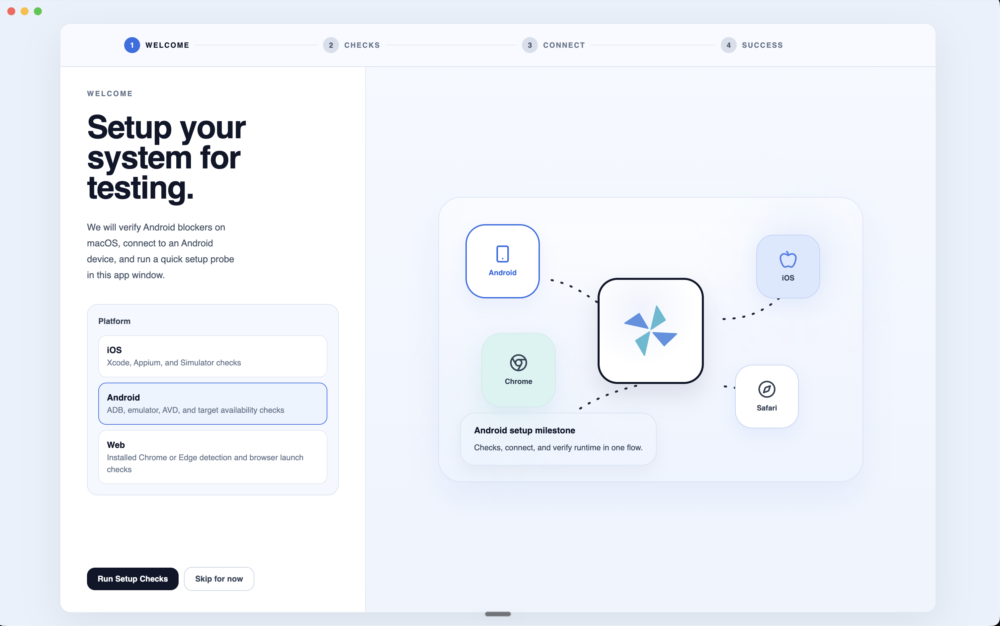
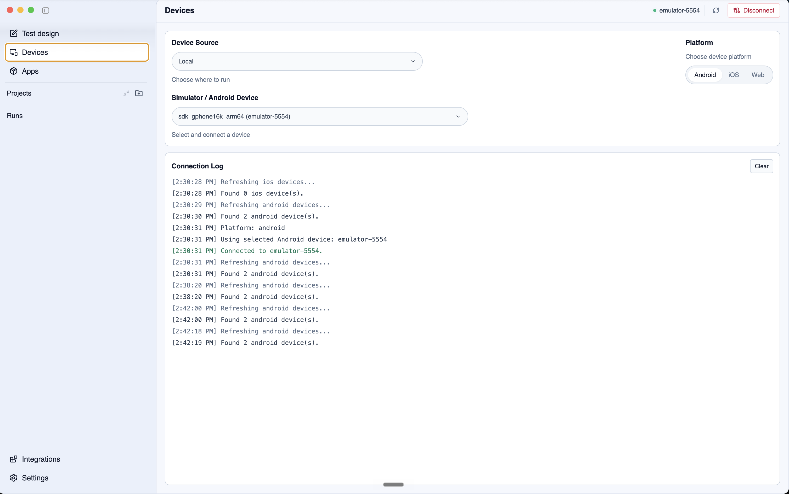

# Setup

This page covers the basic setup required before running Droid CUA tests.

***

## Desktop app

Download and install the Droid CUA desktop app:

* [Mac](https://github.com/loadmill/droid-cua-release/releases/latest/download/Loadmill-Droid-CUA.dmg)
* [Mac Intel](https://github.com/loadmill/droid-cua-release/releases/latest/download/Loadmill-Droid-CUA-intel.dmg)
* [Windows](https://github.com/loadmill/droid-cua-release/releases/latest/download/Loadmill-Droid-CUA-Setup.exe)

After installation, launch Droid CUA and sign in with your Loadmill account or add your OpenAI API key in **Settings**.

When you open Droid CUA for the first time, the setup wizard helps you choose a platform and run the required checks.



***

## Android setup

To test Android apps, Droid CUA needs access to a physical Android device or an Android emulator.

Install and configure:

* Android Debug Bridge (ADB)
* Android Emulator CLI, if you want Droid CUA to launch emulators
* USB debugging on physical Android devices

To confirm ADB is available, run:

```sh
adb version
```

To confirm a device or emulator is visible, run:

```sh
adb devices
```

If the device appears in the list, Droid CUA should be able to connect to it from the desktop app.

Use the **Devices** page to choose the device source, platform, and target device.



***

## iOS simulator setup

iOS simulator testing is available on macOS only.

Install and configure:

* Xcode
* iOS Simulator
* Appium
* XCUITest driver

After setup, open Droid CUA and choose an installed simulator from the device picker.

Use the platform selector on the **Devices** page to switch between Android, iOS, and web targets.

***

## Project setup

Create a Droid CUA project and choose:

* A tests folder for saved `.dcua` files.
* A results folder for run history, reports, and logs.

Keeping `.dcua` files in your app repository makes it easier to review them, commit them, and run the same tests later with the CLI.

If your test needs a mobile app build, add it from the **Apps** page. Droid CUA can manage `.apk`, `.ipa`, and `.app` builds.

***

## App context

For real app testing, create a short `context.md` file next to your tests.

Use it to explain details the agent cannot infer from the screen alone, such as:

* What the app does.
* Which test accounts to use.
* Important screen names and navigation paths.
* Common success messages.
* Any confusing or similar-looking buttons.

Good context makes tests more reliable because the agent has the same product knowledge a teammate would need before testing the app.

***

## Setup troubleshooting

If setup does not work as expected, see [Setup troubleshooting](setup-troubleshooting.md).
