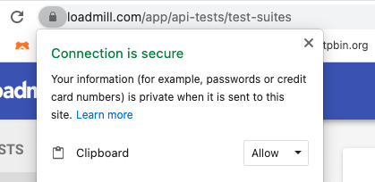

# General troubleshooting

### I'm getting an error like 'Request s been terminated ... Origin is not allowed by Access-Control-Allow-Origin'.

Well, odds are you haven’t enabled CORS for our domain in your app’s server. Please follow [these instructions](https://docs.loadmill.com/load-testing/setup/testing-with-cors).

### I’m getting an error ‘Request has been terminated Possible causes: the network is offline, Origin is not allowed by Access-Control-Allow-Origin, the page is being unloaded, etc.’ when trying to run a test.&#x20;

In general such errors occur in case your network is unstable and the web socket between your browser and our server is disconnecting. Please check your network settings and verify whether other team members experience the issue.

### It seems like I can't paste requests within a flow...

It means that you haven’t given permission to the browser to copy and paste text and images to the clipboard. Just click on the icon next to the URL to enable it.

In case you are using Chrome, you may also go to Settings - look for Clipboard and allow Loadmill to use it.&#x20;
