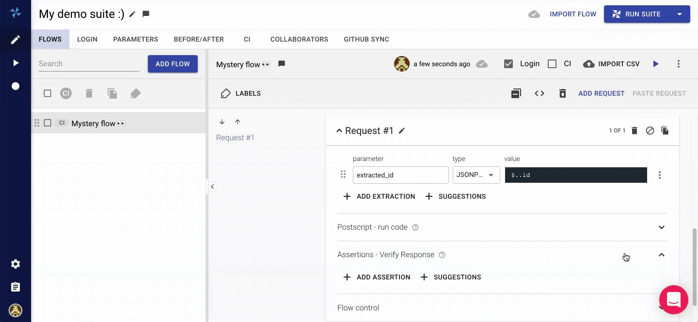
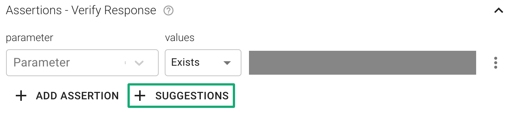
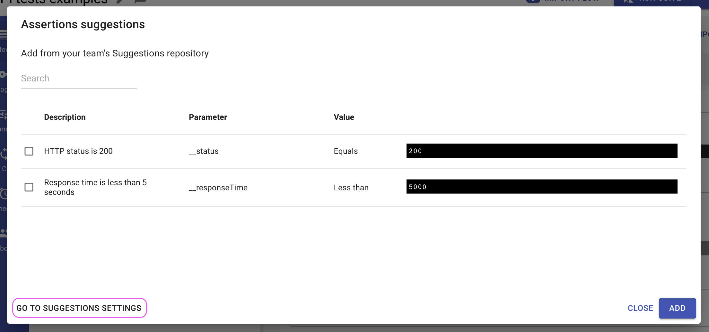

# Assertions - Verify Response

When testing an API, it is usually not enough to verify that all our HTTP requests completed successfully. Often, it is necessary to make sure that we got the correct response from the server by examining the **response status, body or headers**.

With [Loadmill](https://www.loadmill.com), this is made easy by using **Assertions**. Assertions are used in conjunction with [parameters](parameters/) to do just that: examine the server's response and assert its correctness.

You may have an arbitrary number of assertions executed after each successful request. If an assertion fails, the next request will **not be executed** and the test scenario will be marked as **failed**, but the subsequent assertions for the current request **will be executed** nonetheless.

## Assertions editor

Assertions editor can be found in loadmill under each request cubical on it's expanded form.\


<figure><figcaption><p>Assertion section in request editor</p></figcaption></figure>

## Assertion Types

The target of an assertion is always a parameter value. You may use built-in parameters, default parameters or any parameter extracted from the current or previous requests in the **current scenario** as the target.

.png>)

When using assertions, it will usually require to use [extractions](set-parameters-extractions.md) first to set the parameter with proper data and only then to attempt to validate it's form.

There are several types of assertions:

* **Exists** - Validates that a parameter exists and not null.
  * Example 1:\
    Assigning empty term to `param1` will result in assertion failure\
    .png>) (1).png>)
  * Example 2:\
    Assigning any value to `param1` will result in passed assertion\
    .png>).png>)
* **Doesn't exist** - Validates that a parameter doesn't exists or null.
  * Example 1:\
    Assigning any value to `param1` will result in assertion failure\
    .png>).png>)
  * Example 2:\
    Not setting `param1` entirely will result in passed assetion\
    .png>).png>)
* **Equals** - Validates that a parameter is equal to the given expression. The equality check is **case sensitive.**
  * Example 1:\
    The assigned `param1` doesn't equals to loadmill hence will fail in assertion\
    .png>).png>)
  * Example 2:\
    Extracting `$.args.app` json path field to `param1`(from the result that is not displayed) should be equal to "Demo" and will result the assertion to pass\
    Assigning numeric value to `param2` of 11.0 in postscript should be equal to "11", and the assertion will pass.\
    .png>) (1).png>)\
    _**Note** that all values are implicitly compared as strings._
* **Doesn't equal** - Validates that a parameter is NOT equal to the given expression. The equality check is **case sensitive**.
  * Example 1:\
    `param1` shouldn't be equals to 'demo' but it is, hence the assertion will fail\
    .png>).png>)
  * Example 2:\
    `param1` doesn't equals to 'loadmill' hence the assertion will pass\
    .png>).png>)
* **Contains** - Validates that a parameter contains a sub-string. The containment check is **case sensitive**.
  * Example 1:\
    When `param1` set with the value 'loadmill-demo' and doesn't contains the string 'example' the assertion will fail.\
    .png>).png>)
  * Example 2:\
    When `param1` set with the value 'loadmill-demo' and contains the string 'demo', the assertion will pass.\
    .png>).png>)
* **Doesn't contain** - Validates that a parameter DOESN'T contain the given expression. The containment check is **case sensitive**.
  * Example 1:\
    When `param1` set with the value 'loadmill-demo' and contains the string 'demo', the assertion will fail.\
    .png>).png>)
  * Example 2:\
    When `param1` set with the value 'loadmill-demo' and doesn't contain the string 'example', the assertion will pass.\
     (1).png>).png>)
* **Matches** - Validates that a parameter matches the given regular expression.
  * Example 1:\
    The assigned epoch representation of the current time to `param1` will contain 13 digits would not match the regex (`^\d{10}$`), hence the assertion will fail\
    .png>).png>)
  * Example 2:\
    The assigned epoch representation of the current time to `param1` will contain 13 digits and would match the regex (`^\d{13}$`), hence the assertion will pass\
    .png>).png>)
* **Greater than** - Validates that a parameter is greater than the given expression.
  * Example 1:\
    `param1` is assigned with the value 31 that is not greater than 40 hence the assertion will fail.\
    .png>).png>)
  * Example 2:\
    `param1` is assigned with the value 31 which is greater than 30 will make the assertion to pass\
    .png>).png>)
* **Less than** - Validates that a parameter is less than the given expression.
  * Example 1:\
    `param1` is assigned with the value 30 that is not less than 31 hence the assertion will fail.\
     (1).png>).png>)
  * Example 2:\
    `param1` is assigned with the value 31 which is less than 40 will make the assertion to pass\
    .png>) (1).png>)
* **JSON Schema** - Validate that a parameter comply with given [JSON Schema](https://json-schema.org/).
  * Example 1:\
    Given `param1` was set with a json as below, opposed to the expected schema the field "name" is not numeric hence the assertion will fail.\
    .png>) (1).png>)\
    Note, the assertion will suggests to exclude the failing field from the validation schema.
  * Example 2:\
    Given `param1` was set with a json as below and the expected schema describes it correctly, the assertion will pass.\
    .png>).png>)


&#x20;To prepare initial JSON schema out of a JSON you can search for 'from json to schema' in google or use a [tool like this](https://transform.tools/json-to-json-schema).


* **JSON Contains -** Validates that a json contains a subset json, in such way dynamic fields can be omitted to avoid false negatives.\
  \- Accepting any value for individual field will accept "\*" notation\
  Note, the subset json object should preserve the same hierarchal structure as the containing object while fields can be omitted.&#x20;
  * Example 1:\
    Given `param1` was set with a json as below, any mismatch\
    &#x20;in a key or value on same hierarchy will result in assertion error:\
    .png>).png>)\
    Note to the "Exclude ..." notations, clicking on them will adjust the value of the assertion to exclude the failing field.
  * Example 2:\
    Given `param1` was set with a json as below, any partial subset in json-contains validation value with same structure will result pass in assertion:\
    .png>).png>)\
    \- Using star notation to accept any value for `latitude` and `country` fields.\
    .png>)\
    Note, the "\*" notation works only on simple values (strings/numerics/booleans)


You may embed parameters in any assertion expression. These parameters will be evaluated right before the assertion is executed.

See **an example of the assertion** that validates the generated ID is in [the format of UUID](https://docs.loadmill.com/api-testing/test-suite-editor/functions#\_\_is\_uuid-target) below:




:man\_mage: When creating tests via our [Chrome recorder extension](https://docs.loadmill.com/working-with-the-recorder), Loadmill will create **two automatic assertion types** for you:

1. Default assertions - for any extraction we find in the recorded test, we add a default assertion to it (example: "id" exists).
2. Specific assertions - for any parameter with given user key (for example, "success") we extract it and assign to it an assertion (example: "success" equals "true").

Optional automatic JSON Schema assertion: you can enable [this assertion](https://docs.loadmill.com/working-with-the-recorder/recorder-settings#strict-response-validation) within Settings - Recordings.


## Suggestions

In many cases Loadmill users use the same or similar extractions and assertions. We've implemented the Suggestions feature that allows team admins to configure a repository of [extractions](https://docs.loadmill.com/api-testing/test-suite-editor/set-parameters-extractions) and assertions within **Settings - Suggestions**.

Then, each user can add the assertions from the repository by clicking on **+ SUGGESTIONS**.



By default, there are a few common extraction and assertion examples in the repository. Team admins can also navigate to the Suggestions Settings directly from within the suggestion dialog window.



## Caveats

Keep in mind that all parameter values are **textual**, i.e. a parameter has **no type** such as `Number` or `Array` that we know from common programming languages.

This is important in order to avoid confusion when using parameter extractors such as **JSONPath**. For example, consider the following scenario:

1.  Extract the value for `books` via the JSONPath query `student.books` on

    ```javascript
     {
         "student": {
             "books": []
         }
     }
    ```
2. Assert `books` is **Not Empty**.

You may expect this assertion to fail but, in fact, it will succeed. This is because the parameter `books` is evaluated to `[]` and therefore is considered as a non-empty string. One possible way to correct this is to use a **RegExp** assertion on the `books` parameter instead: `\[[^\s]+\]`.
