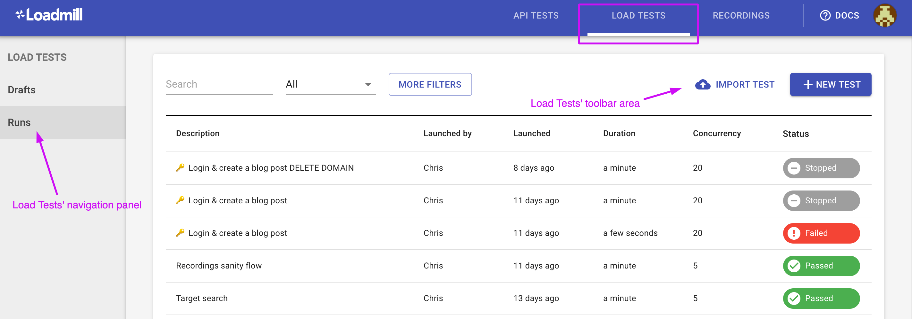
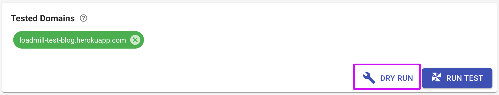
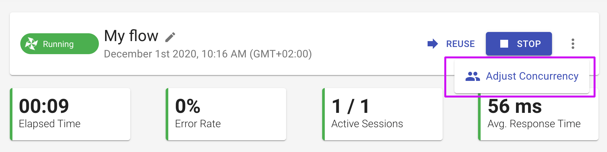
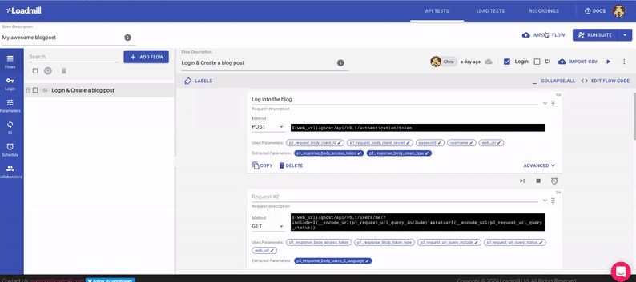

# Load Testing Guide

The Loadmill's Load Testing module allows users to replay their API tests at scale and use real traffic with the ability to target specific countries or go global.

In this quick guide to [Loadmill](https://loadmill.com/app/signup) we will learn how to:

1. Create and run a very simple load test in just a few seconds.
2. Create an API test by using [our Chrome recorder extension](https://chrome.google.com/webstore/detail/loadmill-recorder/gdkmnfehipofdefhpegbgkkocinlaofd?hl=en) and run it as a load test in Loadmill.
3. Run load tests as DRY RUN or at scale.

## **Before you start**

**Signup to Loadmill** at this [link](https://www.loadmill.com/app/signup). We do not ask for any credit card or personal information other than your name and email so it only takes about five seconds. You can also login using your Google or GitHub account. ****

In order to use Loadmill effectively, we highly recommend to read [Core definitions](https://docs.loadmill.com/core-definitions), don't worry, it is only a 2 min read. 😉 

## Let's create and run your first Load test together. 

There are two ways to do that: 

* Creating and running a load test from scratch in Loadmill. 
* Recording an API test by using [our Chrome recorder extension](https://chrome.google.com/webstore/detail/loadmill-recorder/gdkmnfehipofdefhpegbgkkocinlaofd?hl=en) and running it as a load test in Loadmill.

### Creating and running a load test from scratch in Loadmill:



The simplest load test you can create is an HTTP GET request to your web server. 


🧠 Load test may include **100 requests maximum**.


All you need to do is:

1. Click the **NEW TEST** button on the top navigation menu. This will get you to our test editor.
2. Give your new test a short description `My First Test`
3. Copy and paste the website URL into the **URL** text box. In our case, it's going to be `https://loadmill-test-blog.herokuapp.com`. This is a ghost blogging server we are using for testing and demos, so you can use it for tests.
4. Click the **RUN TEST** button and confirm the configuration by clicking **RUN**.


🧙♂ **Note:** At some point you may notice a message stating that your domain is not _verified_ - this only means that you may not run high volume tests before proving ownership of your domain/hostname. You can ignore it for now and learn how to do that later [**here**](https://docs.loadmill.com/load-testing/setup/domain-verification) \(it's actually pretty easy\).


That's it! You have just created and run your first load test in under a minute 🎉

### Recording an API test by using [our Chrome recorder extension](https://chrome.google.com/webstore/detail/loadmill-recorder/gdkmnfehipofdefhpegbgkkocinlaofd?hl=en) and running it as a load test in Loadmill:

1. Create an API test as explained [here](https://docs.loadmill.com/api-testing/getting-started#creating-and-running-an-api-test-by-using-our-chrome-recorder-extension).
2. Go to Loadmill and open the recorded test in your Test Suite.
3. Click on three dots next to the run icon - Click **Convert To Load Test**.
4. To run the load test for the first time, we recommend running it as a trial test. See how to do that below.

### Running a trial test

Before we run a massive load test, we usually want to run just a single iteration of the scenario, to make sure everything works as expected. This is what we call a **DRY RUN**. It's also a very easy way to test your API and can be exported to a **Functional Test** which you can later [use in your CI](https://docs.loadmill.com/integrations/npm-modal).

When we are creating a new test or extending/maintaining an old one, we like to iterate several times - modifying the test and trying it out - until we get the result we want.

To start a trial run, click the **DRY RUN** button at the bottom of the editor. You will be prompted to choose between running **remotely** \(the default\) or **locally**. There are several good reasons you may want to run locally, but for now we leave it on remote.

### Running a load test at scale 

Now that we know that our test is configured correctly, we can run it at scale. To do that:

1. Click the **RUN TEST** button at the bottom of the test editor.
2. Set Test Duration \(minutes\) and Maximum Concurrent Sessions/ Maximum Requests Per Second you would like this test flow to run.
3. Click on "Advanced" to set additional parameters. For example, you can set **Ramp-up** **Duration** \(1 minute by default\) hence a number of concurrent sessions will increase linearly during the ramp-up. 
4. Click **RUN**.

As the test progresses we can see the amount of concurrent sessions **ramping up** linearly and see how **response time metrics** change over time.

In addition, we can **adjust concurrency** **during a test run**. This is a very powerful feature that allows users to see how their test performs with dynamic concurrency changes in real time.

Loadmill keeps track of the request **error rate** and fails the test if it passes a certain threshold \(%50 by default\). We can see the response time for each request and are able to drill down and see the error statistics for each one.


🧠 You can easily run your API Test Suites as load tests by clicking on the drop-down icon within the **RUN SUITE** button - **Run as load test**.


Keep exploring the guides to learn how to analyze load test results, set thresholds and more.

### Support

We are always here if you need any help! Click on the bubble chat button in the lower-right corner of the screen or drop us a line at [support@loadmill.com](mailto:support@loadmill.com).  

