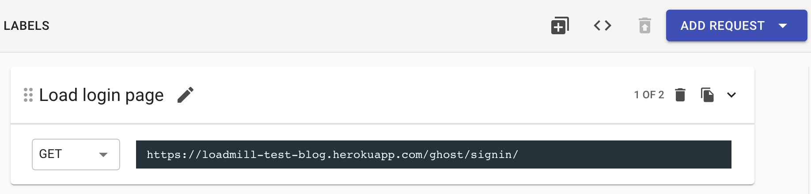
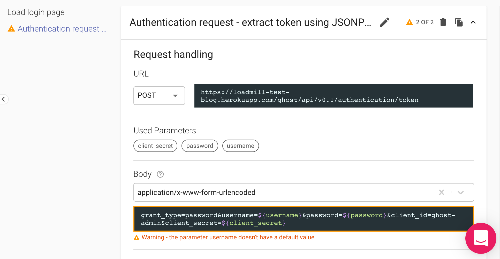

# API Testing Guide

The Loadmill's API testing module allows users to easily create automated API tests taken from real user sessions.

.png>)

In this quick guide to [Loadmill](https://loadmill.com/app/signup) we will learn how to:

1. Create and run a simple API test by using our [Chrome recorder extension](https://docs.loadmill.com/working-with-the-recorder).
2. Create and run an API test from scratch in Loadmill.

## **Before you start**

**Signup to Loadmill** at this [link](https://www.loadmill.com/app/signup). If you need a demo application for testing you can use [this one](https://loadmill-test-blog.herokuapp.com).

We do not ask for any credit card or personal information other than your name and email so it only takes about five seconds. You can also login using your Google or GitHub account.

In order to use Loadmill effectively, we highly recommend to read [Core definitions](https://docs.loadmill.com/core-definitions). Don't worry, it is only a 2 min read. :wink:

## Let's create and run your first API test together.

There are two ways to do that:

* Recording an API test by using our [API Test recorder](https://docs.loadmill.com/working-with-the-recorder#loadmill-chrome-recorder-extension) and running it in Loadmill.
* Creating and running an API test from scratch in Loadmill.

### **Creating and running an API test by using our API Test recorder:**


Recording and running an API Test


1. Download the extension [here](https://chrome.google.com/webstore/detail/loadmill-recorder/gdkmnfehipofdefhpegbgkkocinlaofd?hl=en).
2. Open the Chrome Developer Tools and switch to the Loadmill Rec tab.
3. If you are not logged in to Loadmill, you will be prompted to the login page.
4. Create a Test Suite in Loadmill that will hold recorded flows, and select it in the extension.
5. Clear the captured requests list and navigate to the tested website.
6. Use the filter and the request's delete buttons to filter out irrelevant requests. You can also see the request and response body by clicking on the expanding arrow within requests.
7. When you are done recording your session, click the "Upload" button at the bottom.
8. Go to Loadmill and open the recorded test in your Test Suite.
9. Run the Test Suite by pressing the "RUN SUITE" button and see your results. :partying\_face: Visit [this page](https://docs.loadmill.com/working-with-the-recorder#loadmill-chrome-recorder-extension) to learn more about the Loadmill Chrome recorder extension.


:brain: Loadmill creates **two automatic assertion types** for you:

1. Default assertions - for any extraction we find in the recorded test, we add a default assertion to it (example: "id" exists).
2. Specific assertions - for any parameter with given user key (for example, "success") we extract it and assign to it an assertion (example: "success" equals "true").


### Creating and running an API test from scratch in Loadmill:


:man\_mage: Let's create an API test that validates user login to our [demo testing app](https://loadmill-test-blog.herokuapp.com). API test may include **200 requests maximum**.


1. Click on the .png>) icon at the left panel => Test Suites.
2. Click **NEW TEST SUITE**, give it a name.
3. You can notice that there is one test flow already created in it and you just need to fill it out. The first request will be to get our login page, enter its name, put URL - `https://loadmill-test-blog.herokuapp.com/ghost/signin/`

4\. Click **ADD REQUEST**. This will be an authentication request that will dynamically extract an access token and will allow the user to log in to the app by using his username and password. Find more information about dynamic parameters [here](https://docs.loadmill.com/api-testing/test-suite-editor/parameters).

5\. Enter request name - **Authentication request - extract token using JSONPath from the response**, select "POST" as Method, put URL - `https://loadmill-test-blog.herokuapp.com/ghost/api/v0.1/authentication/token`

6\. Press **Advanced**. This is a place where we set the request body, headers, [extractions](https://docs.loadmill.com/api-testing/test-suite-editor/set-parameters-extractions) and [assertions](https://docs.loadmill.com/api-testing/test-suite-editor/assertions). Select Content type - `application/x-www-form-urlencoded `, put body - grant\_type=password\&username=${username}\&password=${password}\&client\_id=ghost-admin\&client\_secret=${client\_secret}

7\. The warning you've got means that the parameters we set in the body as **username, password, client\_secret** are not defined yet. Go to [the PARAMETERS tab](https://docs.loadmill.com/api-testing/test-suite-editor/test-suite-parameters) and add them as shown below:

username - a%40b.com, password - Test1234, client\_secret - 8c93bf1bb580.

8\. Now go back to the "Flows" tab and run your first API Test Suite by pressing the "RUN SUITE" button. That's it, you can see your results live in Loadmill.


:man\_mage: You can set this test flow [**as Login Flow**](https://docs.loadmill.com/api-testing/test-suite-editor/global-login-flow) so that it will run before each flow within the Test Suite. To do that, click on three dots within the test flow (next to the run icon) and press "Set As Login Flow".


:tada: This is only the beginning, continue exploring our guides to master your **Loadmill skills**!

### Support

We are always here if you need any help! Click on the bubble chat button in the lower-right corner of the screen or drop us a line at [support@loadmill.com](mailto:support@loadmill.com).
