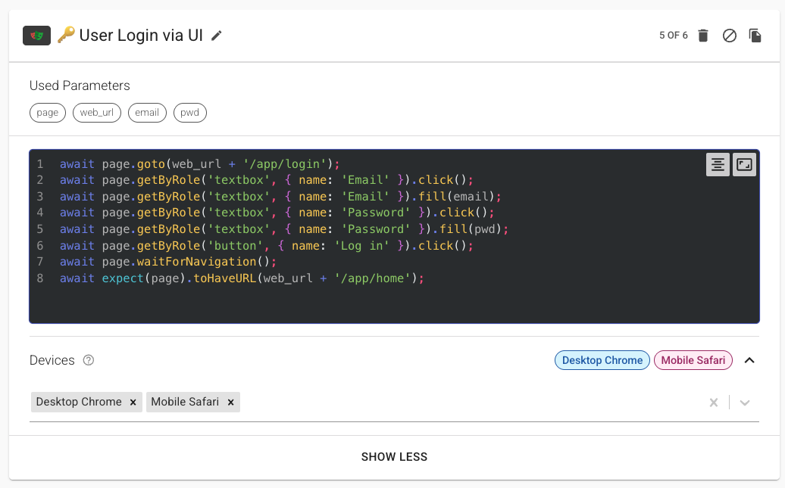

# Hybrid Testing with Playwright Integration

Welcome to the Hybrid Testing section! Here you'll find everything you need to get started with Playwright in Loadmill, including setup, capabilities, and example use cases.

- [Overview](overview.md): What hybrid testing is and why it matters
- [Add Playwright Steps](../test-editor/steps/playwright-step.md): How to add and configure Playwright steps in your tests
- [Playwright Integration Capabilities](capabilities.md): Feature details and how to use them
- [Example Use Cases](examples.md): Practical scenarios for hybrid testing

