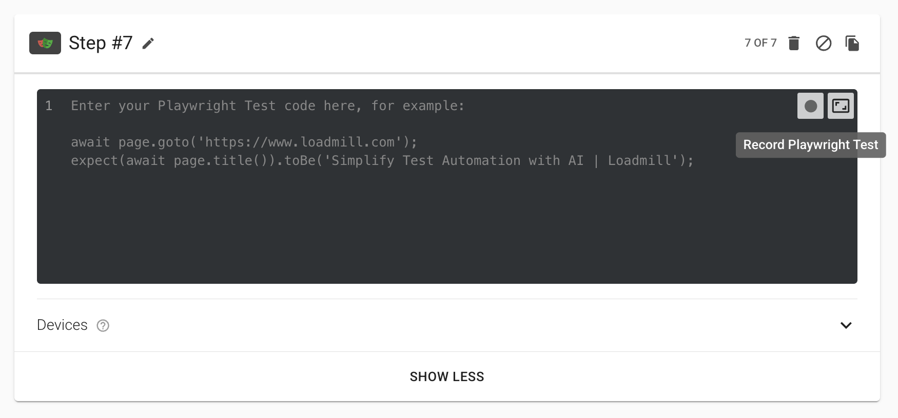
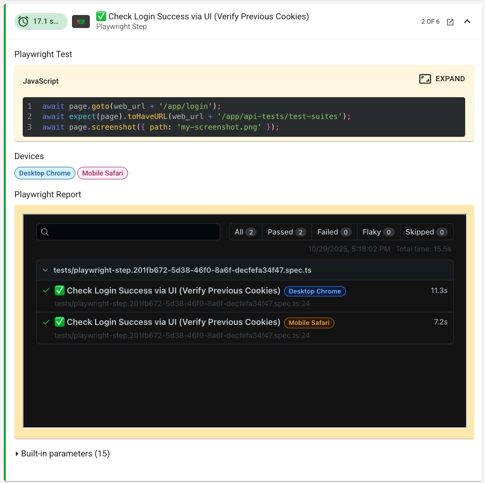
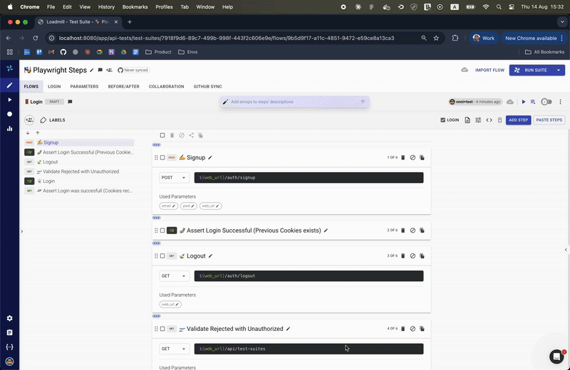

# Playwright Integration Capabilities

## Record Playwright Tests
Easily create Playwright tests by recording your actions in the browser. This feature makes test creation accessible to everyone, even those without coding experience, and speeds up the process for QA and product teams. 

**Note:** To record Playwright tests, you must have the Loadmill Desktop App installed.

**How to use:**
1. Open a flow in the Test Editor.
2. Click the "Record" button in the Playwright step (Desktop App required).
	
3. Interact with your application in the browser window that opens.
4. When finished, close the browser. Loadmill will generate Playwright code based on your actions.

**Tip:** You can edit the generated script for advanced scenarios.

## Cross-Browser Testing
Run your Playwright tests across multiple browsers and devices directly in Loadmill. This ensures your application works as expected for all users, regardless of their browser or device. By automating cross-browser validation, you save time and catch compatibility issues early.

**How to use:**
1. In the Test Editor, add a Playwright step to your flow.

	
2. In the Playwright step settings, select the devices you want to test (e.g., Desktop Chrome, Firefox, Mobile Safari)
	
3. Save and run your test suite. Loadmill will automatically provision and execute tests across the selected browsers.
	

## Debugging
Run your Playwright tests in debug mode and step through the Playwright script inside the flow context in Loadmill. This lets you view exactly what's happening in the test, analyze issues, and recreate bugs more effectively. Debug mode provides a step-by-step view, making it easier to write, troubleshoot, and refine your Playwright scripts.

**Note:** To debug Playwright steps, you must have the Loadmill Desktop App installed.

**How to use:**
1. Open your flow in the Test Editor.
2. Run the test in debug mode.
	[Learn more about Debug Mode](https://docs.loadmill.com/test-editor/flows/flow-controls#debug-mode)
3. Step through the Playwright script, viewing each action and its effect in real time.
	
4. Use this interactive view to analyze issues, recreate bugs, and improve your test scripts.

## Automated Orchestration & Infrastructure
Loadmill automatically provisions browsers, executes tests in parallel, and scales your test runs. You don’t need to manage infrastructure or runners, making your testing pipeline faster, more reliable, and maintenance-free.
**How to use:**
Simply run your test suite with Playwright steps. Loadmill automatically manages browser provisioning, parallel execution, and scaling. No additional setup or runners required.

**Note:** For large test suites, Loadmill will automatically balance load and optimize execution speed.
