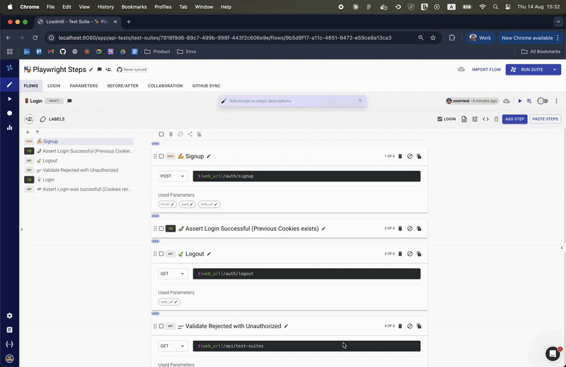

# Debugging Playwright Tests

Debug mode runs a Playwright step interactively through the Loadmill Desktop App. Use it while creating a test or investigating a failure so you can follow each action and inspect the browser state.

## Before you start

Install and start the Loadmill Desktop App. Open the test suite and flow that contain the Playwright step you want to inspect.

## Start a debug run

1. Open the flow in the Test Editor.
2. Select **Debug** from the flow execution controls.
3. Step through the Playwright actions while watching the browser.
4. Review the step output and update the script where necessary.
5. Run the complete flow again after the debug session succeeds.

## What to inspect

When a Playwright step fails, check:

* Whether the page reached the expected state before the action.
* Whether the locator identifies a stable user-facing element.
* Whether data created by earlier API steps is available to the browser step.
* Whether the action needs a more specific assertion or timeout.
* Whether the failure occurs only in a particular browser configuration.

Use the [Flow Controls](../test-editor/flows/flow-controls.md) reference for more information about debug mode and the [Playwright Step](../test-editor/steps/playwright-step.md) reference for supported variables and examples.
