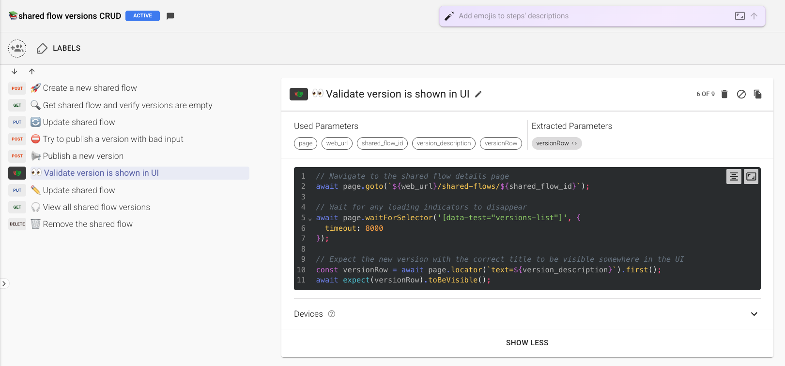

# Overview

Loadmill now offers Playwright as a first-class testing experience, fully integrated for true end-to-end and hybrid testing. You can run UI/browser tests, API tests, or combine both in a single flow — all on Loadmill’s automated infrastructure. No need to manage Playwright environments or runners: browser provisioning, scaling, and orchestration are handled for you.

Why it matters:
- Unified UI and API testing under one platform
- Built-in infrastructure management, reporting, and AI-driven maintenance
- Fast, stable, and scalable tests with reduced operational complexity

