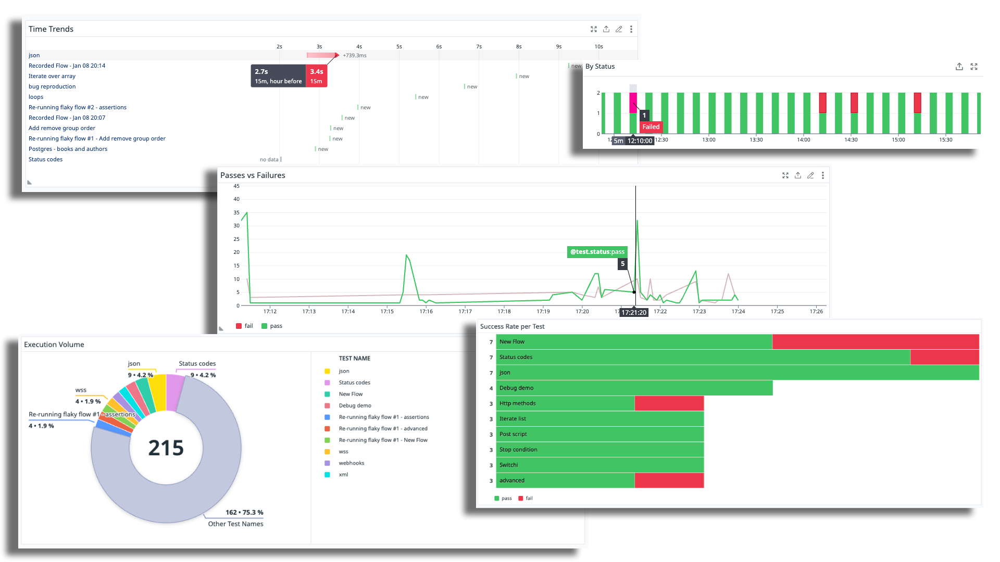

# Datadog Integration

Datadog is a rich analysis and observability platform for engineering stakeholders. Its capabilities include performing BI analysis, custom slicing and graphing on logs and test data, monitoring, and more. Loadmill users can report their test executions to [Datadog's CI visibility product](https://www.datadoghq.com/dg/software-delivery/ci-test-visibility/) and offer a single pane of glass for all of their test results within Dadadog.

<figure><figcaption>
Loadmill test results in Datadog
</figcaption></figure>

Once the data is reported and collected in Datadog, users can integrate it into their existing dashboards and create a new layer of visibility into the health and performance of their automated tests.

<figure><figcaption></figcaption></figure>

<figure><figcaption>
Graphs that can be prepared in Datadog based on loadmill's data
</figcaption></figure>

### Integration Instructions

In loadmill, head to the 'integrations' section under configuration and select 'Datadog'.

<figure><figcaption>
Connect Loadmill to Datadog
</figcaption></figure>

Insert your Datadog's site domain (e.g., app.datadoghq.eu) and an API key that is available under API Keys in Datadog's organizational settings. \\

Within Datadog, users are able to view execution data based on test execution events.\
Loadmill will push execution data on every test plan run.
