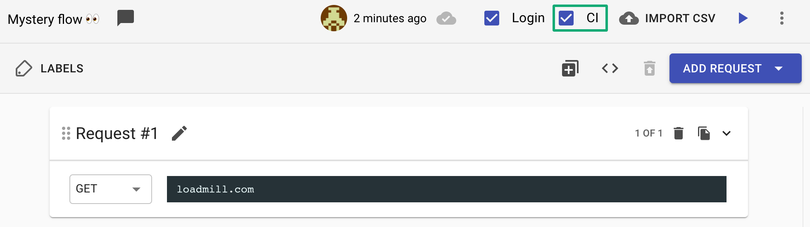
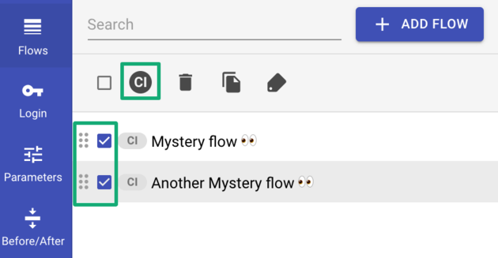

# Integrations FAQs

### **I’m using your npm module but there are flows that are not run although I assigned labels to them.**

It's great that you are using [our labels feature](https://docs.loadmill.com/collaboration/labels-and-filters), just one more thing to do is to make sure that the CI checkbox is checked within the flows and you are all set.

You can easily batch edit flows and check the CI checkbox in them by using this option:  

