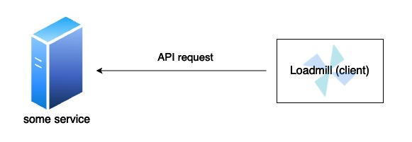

# Kafka Testing

Testing API systems with Kafka might be complicated, but not with Loadmill :). Loadmill provides you with all the adjustments needed to test Kafka properly within your test suites. This article does not explain what Kafka is, but how to integrate it in your tests.

## Loadmill Kafka Relay Client

Kafka uses a proprietary protocol to manage consumption/production of data. Therefore the "classic" way of sending HTTP/WebSocket to a service during a flow should be a bit different - instead of sending the API requests directly to the service, they need to be adapted to fitting Kafka requests.&#x20;

<figure><figcaption>
A non-kafka flow request example
</figcaption></figure>

Meet [Loadmill Kafka-relay image](https://hub.docker.com/r/loadmill/kafka-relay). In order to be able to communicate with your kafka service without feeling that it messes up the flow, direct all of the kafka API requests to a container running the Kafka-relay docker image.

<figure><figcaption>
A kafka based flow architecture
</figcaption></figure>

To achieve a flow like in the above diagram, make sure your testing deployment is also running the `loadmill/kafka-relay` container, then instead of sending your requests directly to your kafka service, send it to your loadmill-kafka-relay, whose API reference can be found in it's [README.md](https://github.com/loadmill/loadmill-kafka-relay/blob/main/README.md) file.
