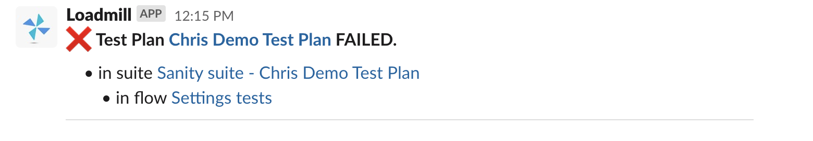

# Slack integration

Slack has more than 12 million daily active users and 156,000 organizations subscribe to the app so it's become essential to get notified about important events via Slack. We introduce our **Loadmill app on Slack** that allows to send notifications per API Test, Load Test, Test Plan run to the Slack channel you wish. Follow the steps below to configure the integration.

1. Navigate to Settings => Integrations. Click CONNECT TO SLACK.

.png>)

&#x20;2\. You will be redirected to the page where you need to click **Allow** in order to give relevant permissions to the Loadmill app.

3\. You are almost set, the only thing is left to do is to choose what notifications you would like to get and in which channel. To do that, go to Notifications (the tab above Integrations) => ADD NOTIFICATION => Notification type: Slack => choose channel => select relevant test type and status.

&#x20;🧠 Tip: the most popular notifications are about Failed Test Plan Runs :)&#x20;

 (1).png>)

That's it, you did it! 🎉 From now on, you won't miss any important Loadmill event.

More about our privacy policy can be found [here](https://app.loadmill.com/assets/privacy-policy.pdf)
