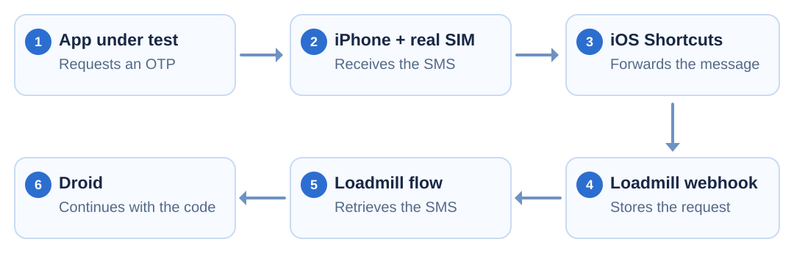
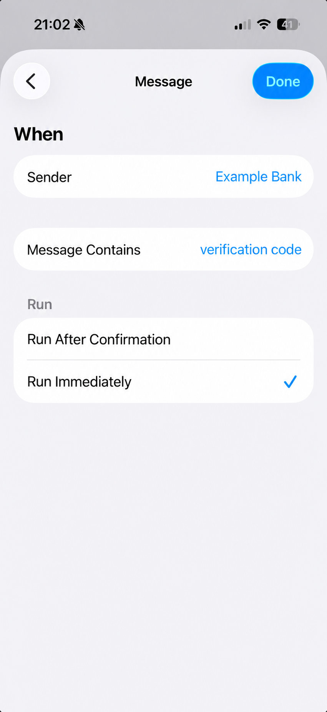
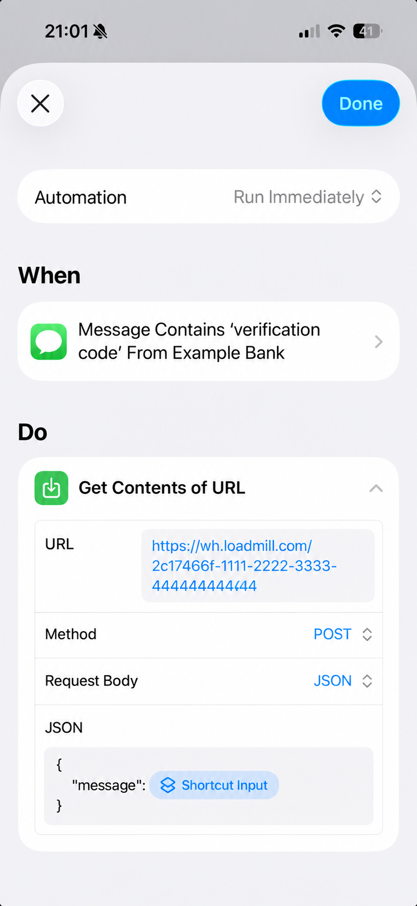
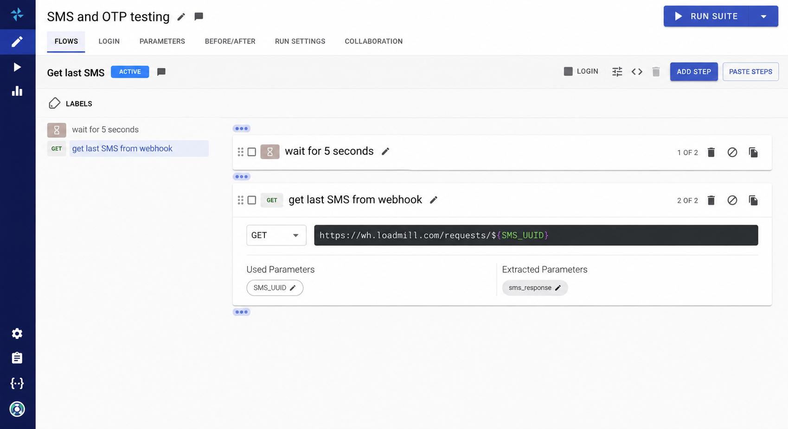
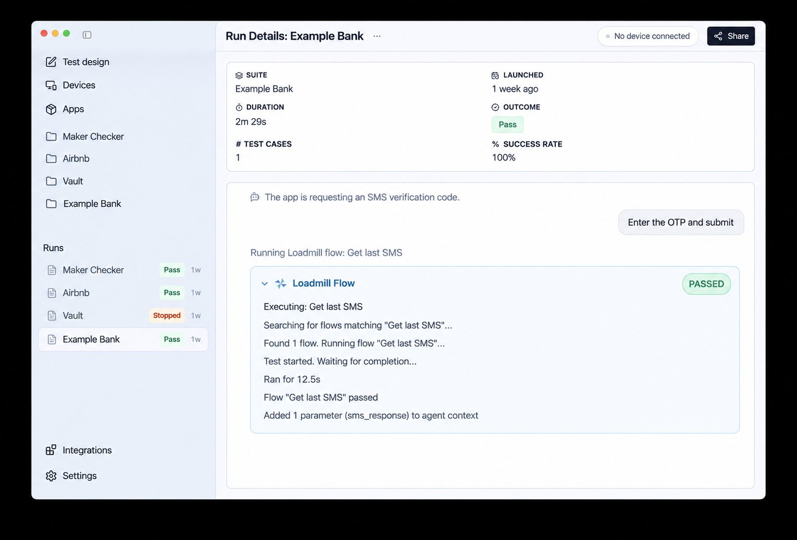

# Receive SMS and OTP Codes in Loadmill Using iOS Shortcuts

Use a real iPhone and SIM as an SMS bridge for tests that need a one-time password or another text message. The built-in Shortcuts app forwards matching messages to a Loadmill webhook, where a Loadmill flow can retrieve the message and make it available to Droid.

Nothing extra needs to be installed on the iPhone.



***

## Before you start

You need:

* An iPhone with a real SIM that can receive the test messages.
* The built-in Apple Shortcuts app.
* A Loadmill account and a test that can request an SMS or OTP.
* A stable, unique identifier for the test phone, such as `2c17466f-1111-2222-3333-444444444444`.

Use one identifier per test phone and keep it stable. The examples on this page use fictional values; do not copy them into a shared test environment.

The identifier becomes part of two URLs:

* Shortcuts sends messages to `https://wh.loadmill.com/<SMS_UUID>`.
* The Loadmill flow retrieves them from `https://wh.loadmill.com/requests/<SMS_UUID>`.

For more information about how the service stores and retrieves requests, see [Webhook Testing](webhook-testing.md).

***

## Create the iOS automation

In **Shortcuts**, open **Automation**, tap **+**, and create a **Message** automation.

Choose the narrowest trigger that matches your test messages:

* **Sender** limits the automation to a particular sender.
* **Message Contains** limits it to messages containing a stable phrase such as `verification code`.
* When both are set, the incoming message must match both conditions.

Depending on the provider, the sender may appear as a phone number, a saved contact, or an alphanumeric name.

Select **Run Immediately** so the message is forwarded without requiring confirmation.

<figure><figcaption><p>Filter the messages and allow the automation to run immediately.</p></figcaption></figure>

Apple documents these options under [Communication triggers](https://support.apple.com/en-tm/guide/shortcuts/apdd711f9dff/ios). Labels may vary slightly between iOS versions.

### Send the message to Loadmill

Add **Get Contents of URL** as the automation action, expand it, and configure:

* **URL:** `https://wh.loadmill.com/<SMS_UUID>`
* **Method:** `POST`
* **Request Body:** `JSON`
* **message:** the incoming message from **Shortcut Input**

You can include the sender as another JSON field if the test needs it, but the message body is enough for the basic flow.

<figure><figcaption><p>Send the incoming message to the phone's Loadmill webhook URL.</p></figcaption></figure>

For more details about the action, see Apple's [Request an API in Shortcuts](https://support.apple.com/en-in/guide/shortcuts/apd58d46713f/ios).

Once saved, the automation runs in the background. For example, if the phone receives `Your verification code is 381249`, Shortcuts immediately posts that message to the phone's Loadmill webhook URL.

```http
POST https://wh.loadmill.com/2c17466f-1111-2222-3333-444444444444
Content-Type: application/json

{
  "message": "Your verification code is 381249"
}
```

No interaction with the iPhone is required.

***

## Retrieve the latest message in Loadmill

Create a Loadmill flow named **Get last SMS**. The flow waits briefly for message delivery, requests the latest payload stored under `SMS_UUID`, and extracts it as `sms_response`.

<figure><figcaption><p>Retrieve the latest message and extract it as <code>sms_response</code>.</p></figcaption></figure>

You can import the following flow YAML:

```yaml
meta:
  description: Get last SMS
requests:
  - description: wait for 5 seconds
    type: Wait
    wait: 5

  - description: get last sms from webhook
    method: GET
    url: https://wh.loadmill.com/requests/${SMS_UUID}
    extract:
      - sms_response:
          jsonPath: $["body"]["message"]
    type: Request

scopeParameters: []
```

Provide `SMS_UUID` as a flow parameter using the same identifier configured on the iPhone. Keep the parameter out of the file when different environments or test phones use different identifiers.

A fixed wait is a simple starting point for local testing. Delivery time can vary, so CI flows should poll for the expected message until a reasonable timeout instead of assuming it will always arrive within five seconds. See the [Response Handling section](../test-editor/steps/request-editor.md#the-response-handling-section) for the available flow controls.

***

## Use the message in a Droid test

A Droid test can request the OTP through the application, run the saved Loadmill flow, and then use the returned code in the next UI instruction.

```text
Enter the test phone number and request a verification code.
loadmill: Get last SMS
Enter the verification code returned by the Loadmill flow.
Verify that login succeeds.
```

The `loadmill:` instruction tells Droid to find and run the matching saved flow. Droid waits for the flow to finish and makes the relevant returned information available to later instructions. Refer to the result by meaning, as shown above, rather than inventing placeholder syntax for `sms_response`.

<figure><figcaption><p>The Loadmill flow passes the SMS response into Droid's context, ready for the next instruction.</p></figcaption></figure>

> Droid can use a real SMS sent to a real phone as context for the rest of the test.

For the broader pattern, see [Prepare state through APIs](../droid-cua/best-practices.md#prepare-state-through-apis).

***

## Keep the flow reliable and safe

Use one active test per phone and `SMS_UUID`. Parallel tests can otherwise retrieve the wrong message. For parallel execution, use separate phones and identifiers or add a correlation value that lets each flow select its own message.

Request the OTP immediately before retrieving it. Reusing a shared identifier for unrelated runs can return an older message if the new SMS is delayed or never arrives.

Treat the webhook URL as sensitive test configuration. A UUID separates messages but is not authentication, so use a unique, hard-to-guess value, keep it out of screenshots and logs, and use a dedicated test SIM rather than a personal phone number. Avoid logging OTPs beyond the test evidence you actually need.
