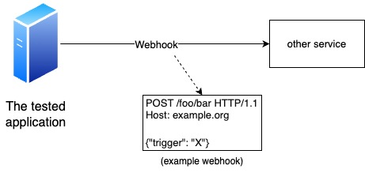
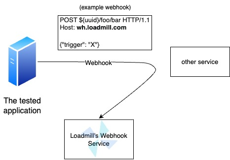
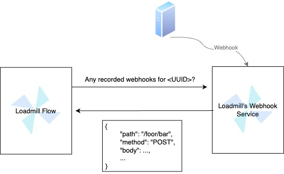

# Webhook Testing

When testing a system that sends webhooks and triggers other systems, we aim to avoid actual triggering but still want to verify the request sent as the webhook and its validity.

<figure><figcaption>
Normally the application triggers another service
</figcaption></figure>

A webhook is essentially a regular HTTP request; therefore, Loadmill's webhook service is a regular HTTP server that stores the requests it receives, without triggering any other system as a webhook was intended to do.

<figure><figcaption>
Testing scenario: the third party service stays untriggered
</figcaption></figure>

The only important thing here is the host (in this case `https://wh.loadmill.com/${UUID}`); all other details should fit the webhook's structure.

> The ${UUID} allows for the identification of requests.

For instance, the webhook request should be an `HTTP POST` request to `https://example.org/foo/bar`. In order to test that without actually triggering the `example.org` service, and to check the webhook's validity, we should only replace the service's address with Loadmill's webhook-service address, and all the rest should be the same as it should be in the original webhook, i.e., an `HTTP POST` request to `https://wh.loadmill.com/${UUID}/foo/bar`.

<figure><figcaption>
Querying the webhook in order to check it's validation
</figcaption></figure>

Querying a webhook from the service can also include filters to specify the desired webhook. For instance, if multiple webhooks were sent to the service, each with a different value for the header "unique\_id," we can easily locate a specific webhook by applying the header filter to the request. This would look like `https://wh.loadmill.com/requests/${UUID}?headers.unique_id=<ID>`.

### Webhook service in Docker

It is possible to run Loadmill's webhook service from Docker as well. This option is useful, for example, if you want to run it within your test environment. You can learn more about the webhook-service docker [here](https://hub.docker.com/r/loadmill/webhook-service).
