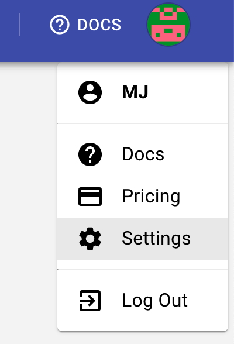

# iOS Wi-Fi settings


Before following the next steps, make sure you are connected to the same network as the machine hosting loadmill desktop app proxy.


To set the proxy on your wifi connection:

1. Go to the main `Settings` menu and select `Wi-Fi`. \
   .png>)
2. Tap the "i" icon next to your connected Wi-Fi network. \
   .png>)
3. Scroll down to the `HTTP Proxy` section and select "Manual." \
   
4. Enter the IP address and port number provided by the Loadmill Desktop App for the MITM proxy server.\
   &#x20;.png>)\

_The IP and the port number can be found at the upper area of the loadmill desktop app in the proxy section._

<figure><figcaption></figcaption></figure>

5. Save the settings and ensure that your device is still connected to the Wi-Fi network.
