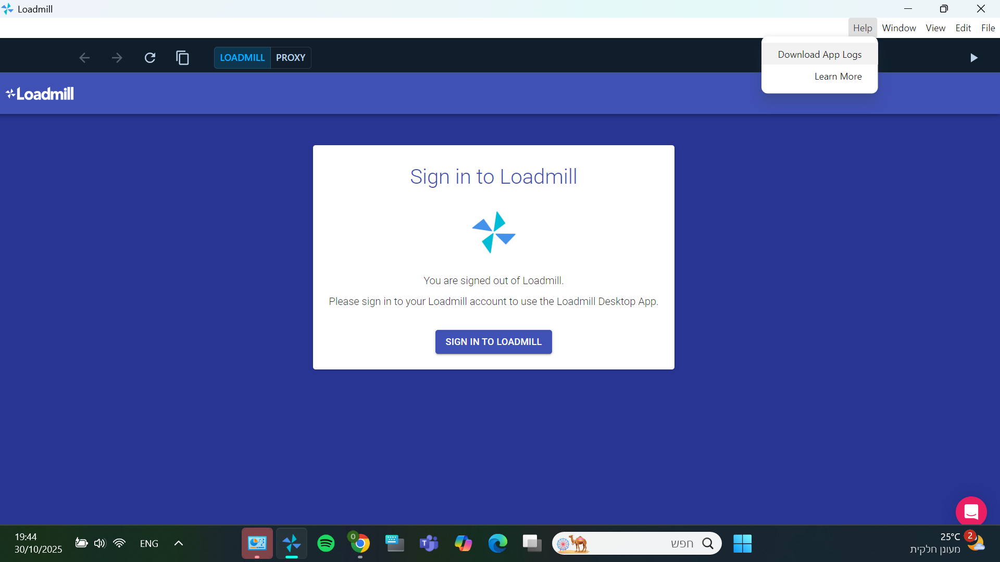

# Loadmill Desktop App – Windows Installation Prerequisites

This document outlines the required prerequisites and setup steps before installing the Loadmill Desktop App on a Windows system. Ensure these requirements are met to avoid installation or runtime issues.

---

## ✅ System Requirements

- **Operating System:** Windows 10 or Windows 11 (64-bit)  
- **Processor:** Intel i3 or higher / AMD equivalent  
- **Memory:** Minimum 4 GB RAM (8 GB recommended)  
- **Disk Space:** At least 500 MB free space for installation plus additional space for captured HAR data and logs  
- **Network:** Stable internet connection required to communicate with Loadmill cloud services  

---

## ⚙️ Software & Access Requirements

- Administrative privileges to install software and security certificates  
- Optional: Corporate proxy credentials if behind enterprise firewall (the app supports proxy configuration)  

---

## 🖥 Installation on Windows

1. Download the latest version of Loadmill desktop app for Windows from [here](https://github.com/loadmill/desktop-app/releases/download/v3.7.8/Loadmill-desktop-app-3.7.8-Setup.exe)  
2. Double-click to run the setup
3. App will get installed in the following folder:  
   `C:\Users\<username>\AppData\Local\desktop_app`

---

## 🔐 Certificate Installation (for HTTPS Traffic Capture)

- When capturing HTTPS traffic (from browsers or mobile devices), Loadmill installs a local root certificate to decrypt HTTPS traffic  
- During installation, accept the certificate prompt to allow HTTPS capture  
- If using for mobile capture: export and install the certificate on the mobile device via Wi-Fi proxy configuration  
- Ensure both desktop and mobile device are on the same Wi-Fi network for proper capture

---

## 🌐 Network Configuration

- Allow outbound HTTPS (TCP port 443) to Loadmill’s cloud endpoints  
- Ensure that any corporate VPNs or firewalls do not block the Loadmill app executable or proxy ports  
- For capturing mobile traffic, verify the device proxy is configured to the desktop app’s IP and port (shown within the app)  

---

## 📁 Log and Configuration Paths

- **Log files:**  
  `C:\Users\<username>\AppData\Roaming\Loadmill\logs`  
- **Configuration and captured data:**  
  Stored under the app’s user data directory in `AppData\Roaming\Loadmill`  

---

## 📞 Support

For installation or connectivity issues, contact Loadmill Support via [support@loadmill.com](mailto:support@loadmill.com) or refer to the official documentation at [https://docs.loadmill.com/](https://docs.loadmill.com/)
