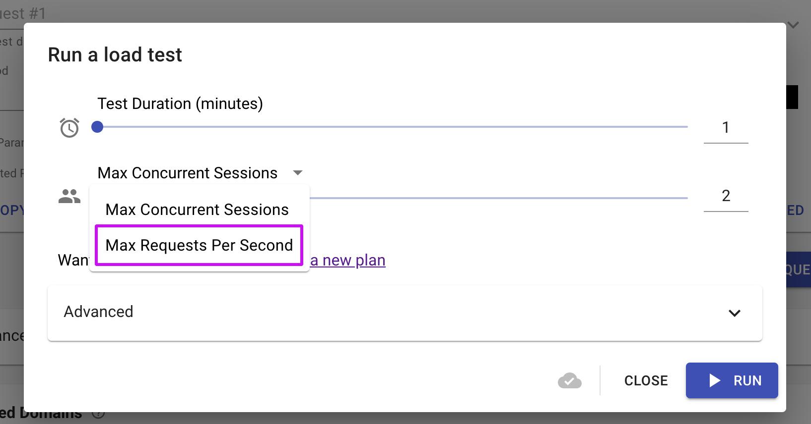
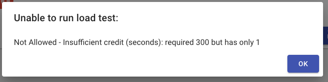

# Load Testing FAQs

### **Is there a way to run a load test by throughput instead of setting the maximum number of concurrent sessions?**

Sure, click the arrow next to **Max Concurrent Sessions**, select **Max Requests Per Second** and set the number you wish.



### **I've got an error message below... what should I do?**



The message you've got means that you've reached your plan's maximum credit. Please go to **Settings -> Billing -> Change Plan** and upgrade. If you don't have access to the Billing tab, contact your team admin who will be able to buy more credit.

### **Can I add multiple conditions to a flow control step?**

Yes, you can combine multiple conditions by using an **assignment extraction** in the **Extractions - Set Parameters** section.

Use the following syntax when assigning a value to a parameter:

```
${condition1 && condition2}
```

This ensures that the combined condition is evaluated before being used in the flow control step. Do not place this expression directly in the loop input parameter itself.
