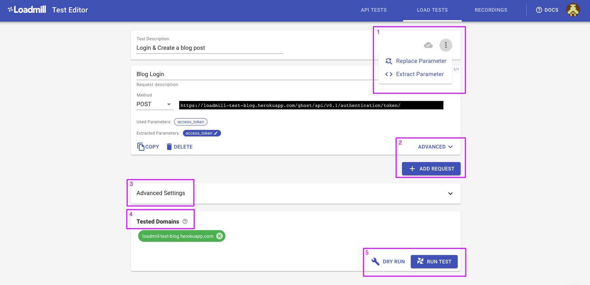

# Load Test Editor

Let's look at the Load Test Editor.

| Option  | Description |
| :--- | :--- |
| 1.The Autosave status of your load test | You don't need to save your test, we do that for you, unless the test configuration is invalid |
| Replace Parameter | Easily replace the parameter you wish so all of the flow's requests will be affected |
| Extract Parameter | [Extract a value to a parameter](https://docs.loadmill.com/load-testing/working-with-the-test-editor/quick-parameter-editing) from all across the test requests |
| 2. ADVANCED | Manage request headers, parameters and assertions. [Learn More](https://docs.loadmill.com/api-testing/test-suite-editor/request-editor)  |
| ADD REQUEST | Add requests to your load test |
| 3. Advanced Settings | Configure Iterations, E-mail notifications, enable Cookies, [Import CSV](https://docs.loadmill.com/load-testing/working-with-the-test-editor/data-from-csv-files) and more  |
| 4. Tested Domains | Manage domains/hosts tested by the test requests. See your domain in red? Check how to fix it [here](https://docs.loadmill.com/load-testing/setup/domain-verification) |
| 5. DRY RUN | Run your load test as [a single iteration](https://docs.loadmill.com/load-testing/getting-started#running-a-trial-test) |
| RUN TEST | Run your load test at scale |

