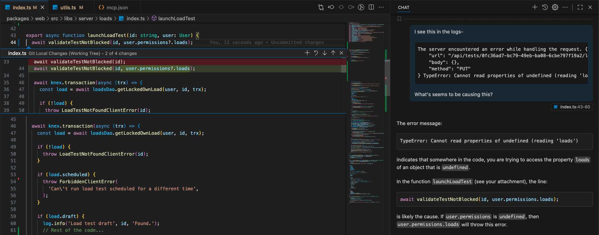
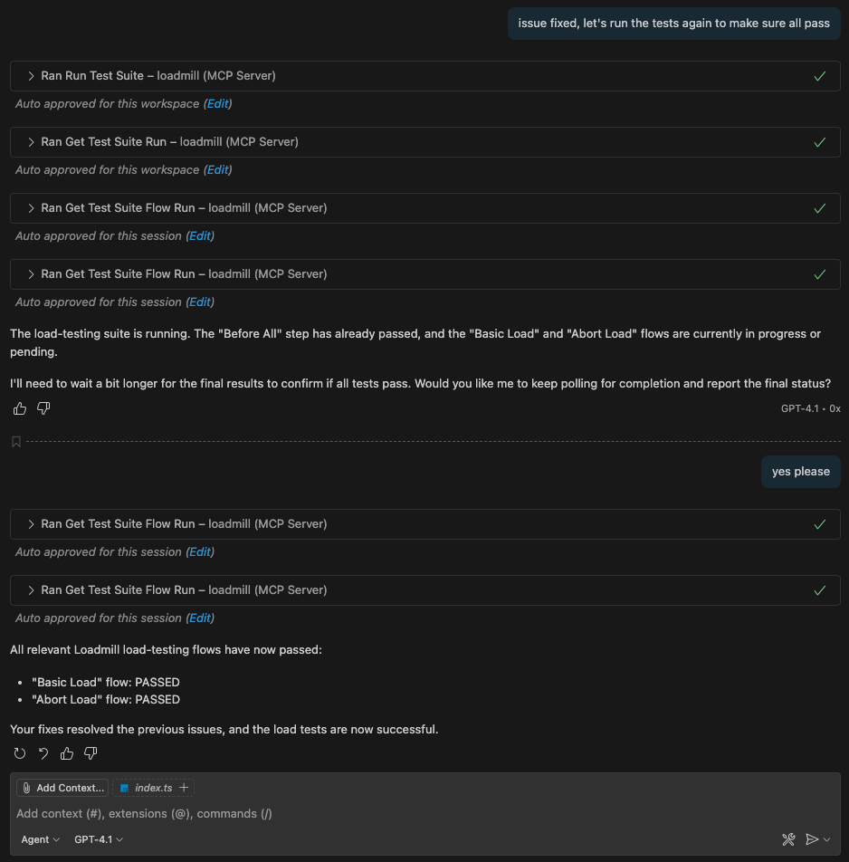

# AI-Native E2E Testing

## Why Loadmill MCP?

Loadmill MCP brings the power of AI-native workflows to E2E and behavioral testing. Inspired by the latest advances in agentic workflows, Loadmill MCP lets you:

* **Generate new E2E tests in seconds from natural language.**
* **Run tests as you develop, with instant feedback and AI-powered insights.**
* **Automate repetitive QA tasks and empower your team to ship with confidence.**

Test generation is also supported for hybrid testing (combining API and UI steps). [Learn more in the Hybrid Testing section.](../hybrid-testing/overview.md)

***

## Core Features

* **AI-Native Test Authoring:** Describe what you want to test in plain text. Instantly get a ready-to-run E2E suite—no boilerplate, no manual scripting.
* **Continuous Feedback Loop:** Run tests directly from your IDE or any AI tool, see results and logs in real time, and get actionable suggestions for failures.
* **Self-Verifying Workflows:** Loadmill MCP enables agents to generate, run, and validate tests in a closed loop—ensuring your E2E flows work as intended after every change.
* **Collaboration for All:** Anyone on your team, regardless of experience, can contribute meaningful tests and improve coverage. No prior testing knowledge required.

***

## Real-World Workflow: Main Use Cases

### 1. Run E2E Tests & Analyze Results While Developing

With Loadmill MCP, you can instantly validate your changes as you code—without leaving your IDE. This approach keeps you focused, reduces context switching, and ensures that every update is automatically checked against your real-world E2E scenarios. The result: faster feedback, fewer bugs, and greater confidence in every release.

This example shows how you can use Loadmill MCP to quickly validate your changes and build with confidence. The workflow below is shown with VS Code and GitHub Copilot, but you can achieve the same results with any compatible IDE or AI tool:

**Step 1: Make changes and run tests**

After updating your code (for example, changing a function or fixing a bug), trigger all relevant E2E tests. Test results appear instantly—if there are failures, you’ll see them right away.


**Step 2: Analyze failures and fix the issue**

Use Loadmill MCP to get and analyze the failures, leveraging its insights and suggestions to help you find a solution. Update your code to address the issues.



**Step 3: Re-run tests and confirm success**

Re-run the tests. This time, all tests pass, giving you confidence to continue development.



***

### 2. Generate New E2E or Hybrid Tests in Seconds Using Free Text

With Loadmill MCP, creating new tests is as simple as describing what you want to check. Just type your scenario in plain text and let the AI instantly generate a ready-to-run E2E test flow or suite for you.


This workflow is designed for speed and flexibility:

* **Instant test generation:** Go from a free-text idea to a fully structured test in seconds. No manual scripting, no previous testing experience needed.
* **Flexible integration:** Once generated, you can either:
  * **Import the test file directly into Loadmill** and run it as part of your existing suites, or
  * **Sync the test via git**—push it to GitHub (or any version control system) and have it run automatically as part of your CI/CD pipeline.
* **Always up-to-date and spec-compliant:** Every test generated by Loadmill MCP is built using the latest Loadmill test-suite schema, so you can be sure your tests are always aligned with current Loadmill standards—no outdated formats, no compatibility worries.

***

## Getting Started

### Installation

```bash
npm install -g @loadmill/mcp
```

### Connecting Your IDE

**First, generate a Loadmill API token from your** [**account settings**](https://app.loadmill.com/app/user/settings/security)**.**

#### VS Code

Add a server configuration to your IDE:

```json
{
  "servers": {
    "loadmill": {
      "type": "stdio",
      "command": "npx",
      "args": ["@loadmill/mcp"],
      "env": {
        "LOADMILL_API_TOKEN": "${input:loadmill-api-token}"
      }
    }
  },
  "inputs": [
    {
      "id": "loadmill-api-token",
      "type": "promptString",
      "description": "Loadmill API token",
      "password": true
    }
  ]
}
```

#### Cursor

Setup Steps:

1. Open the Cursor application.
2. Navigate to **Cursor Settings → MCP & Integrations → MCP Tools → New MCP Server**.
3. This opens `MCP.json` where you paste the following configuration:

```json
{
  "mcpServers": {
    "loadmill": {
      "command": "npx",
      "args": [
        "@loadmill/mcp"
      ],
      "env": {
        "LOADMILL_API_TOKEN": "${env:LOADMILL_API_TOKEN}"
      }
    }
  }
}
```

Set your `LOADMILL_API_TOKEN` environment variable before launching Cursor.

***

## Resources

* [Loadmill MCP official npm page](https://www.npmjs.com/package/@loadmill/mcp)
