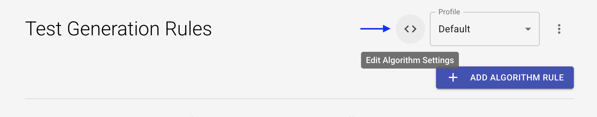

# Algorithm Configuration Guide

When creating a test in Loadmill, you can configure a rich set of rules that determine how your test scenario is analyzed, interpreted, and converted into an executable flow.
These settings control assertions, filtering, data cleanup, parameter extraction, uniqueness detection, and various advanced behaviors of the test-generation algorithm.

This guide explains every configuration option, what it does, when to use it, and how it affects the resulting test.

To apply or modify these configurations, go to the Algorithm page in Loadmill and make changes through the UI or click `Edit Algorithm Settings` to edit the JSON directly.



Then, edit or add the relevant rules in the appropriate JSON properties.

## Table of Contents {#toc}
#### 1. [Assertions](#assertions)
- [Automatic Assertions](#automatic-assertions)
- [Automatic Assertions by URL](#automatic-assertions-by-url)
- [Automatic Polling by URL](#automatic-polling-by-url)
- [Strict Response Validation](#strict-response-validation)

#### 2. [Filtering & Control](#filtering-and-control)
- [Filter Irrelevant Requests](#filter-irrelevant-requests)
- [Filter Request by Body](#filter-request-by-body)
- [Headers Filters](#headers-filters)
- [Ignored Keys](#ignored-keys)
- [Ignored Values](#ignored-values)
- [Irrelevant GraphQL Operations](#irrelevant-graphql-operations)
- [Irrelevant Soap Actions](#irrelevant-soap-actions)
- [Keep All MIME Types](#keep-all-mime-types)
- [Relevant URLs](#relevant-urls)
- [Session Cut URLs](#session-cut-urls)
- [URL Blacklist](#url-blacklist)

#### 3. [Data-cleanup](#data-cleanup)
- [Don't Extract From Response by URL Regex](#dont-extract-from-response-by-url-regex)
- [Keep Original Values](#keep-original-values)
- [Max Entities of Same Type](#max-entities-of-same-type)
- [Reduce Global Parameters](#reduce-global-parameters)

#### 4. [Structure & Semantics](#structure-and-semantics)
- [Fields Hierarchy](#fields-hierarchy)
- [JQuery Ignored Elements](#jquery-ignored-elements)
- [JSONPath Ignored Keys](#jsonpath-ignored-keys)

#### 5. [Parameter Detection](#parameter-detection)
- [Custom Identifiers](#custom-identifiers)
- [Custom Uniqueness](#custom-uniqueness)
- [Default Values](#default-values)
- [Include Failed Requests](#include-failed-requests)
- [Keys Value as Key](#keys-value-as-key)
- [Max Response Content Byte Size](#max-response-content-byte-size)
- [Nested Value Decoding](#nested-value-decoding)
- [Non Secret Keys](#non-secret-keys)
- [ResponseRegexExtractors](#response-regex-extractors)
- [Search Unique Values](#search-unique-values)
- [Special Keys](#special-keys)
- [Synonyms](#synonyms)
- [Value Holder Key Map](#value-holder-key-map)

#### 6. [Advanced & Serialization Settings](#advanced-and-serialization-settings)

- [Allow Dots](#allow-dots)
- [Array Format](#array-format)
- [Decode URL Encoded Body](#decode-url-encoded-body)
- [Prettify Request Body](#prettify-request-body)
- [Split Origin](#split-origin)
- [Xml Decode](#xml-decode)

#### 7. [Uniqueness & Extraction Controls](#uniqueness-and-extraction-controls)
- [ID Prioritization](#id-prioritization)
- [Max Uniqueness Length](#max-uniqueness-length)

#### 8. [Post Processing Editing](#post-processing-editing)
- [Yaml Regex Replacers](#yaml-regex-replacers)
- [Regex Replacers](#regex-replacers)
___
## Assertions
### Automatic Assertions
Defines **automatic assertions** that Loadmill applies to extracted parameters.
##### When to use:
- When your API contains stable response fields that should always be validated.
- When you want to detect silent failures (`200 OK` but the operation logically failed).

##### Structure:
**`assertions`** *object* 

An object that defines how to generate assertions for extracted parameters.

The object includes the following properties:
- **`isDefaultAssertion`** *boolean, Defaults to `true`*

    Defines basic automatic assertions of *Exists* applied to all extracted parameters.

- **`specificAssertions`** *array, Defaults to [ ]*

    Define specific assertion applied to parameters with defined keys.
Each item in the array contains:
  - **`key`** *string* 
      
      The key that, when encountered, should create the automatic assertion.
  - **`assertion`** *{ [assertionType: string]: string }* 
      
      Defines the assertion to apply.
      The object must contain a single assertion operator (e.g., equals, matches, contains) and its expected value.

Example:
```json
"assertions": {
  "isDefaultAssertion": true,
  "specificAssertions": [
    {
      "key": "success",
      "assertion": { "equals": "yes" }
    }
  ]
}
```

---
### Automatic Assertions by URL 
Extracts a value from responses whose URL matches a pattern, then asserts it.
###### When to use:
* When a specific endpoint always returns a value you want to verify.
###### Structure:
**`autoAssertionsByUrl`** *array*
  
  Defines automatic assertions for specific endpoints. Each item specifies a URL pattern, a JSONPath to extract the value, and the assertion to apply. 

Each item in the array contains:
  - **`url`** *string*
    
    Regex pattern to match the request URL.

  - **`jsonpath`** *string*
    
    JSONPath expression to extract the value from the response.

  - **`assertion`** *{ [assertionType: string]: string }*
    
    Assertion operator and expected value (e.g., `{ "equals": "processed" }`).

Example:
```json
"autoAssertionsByUrl": [
  {
    "url": "/api/orders/[0-9]{8}$",
    "jsonpath": "$.data.status",
    "assertion": { "equals": "processed" }
  }
]
```
---
### Automatic Polling by URL
Defines **automatic polling loops** for endpoints matching specific URL patterns.

###### When to use:
- When your system performs asynchronous operations requiring repeated polling.
- For status endpoints that eventually reach a final state.
- When testing processes that aren't instantaneous (e.g., onboarding, file processing).

###### Structure:

**`automaticLoops`** *array*

An array where each item defines the conditions under which an automatic loop should be added.

Each item in the array contains:
- **`url`** *string*

  Regex pattern to match the request URL.

- **`loop`** *object*

  The loop includes the following properties:
    - **`iterations`** *number*

      Number of polling attempts.
    - **`assert`** *{ [assertionType: string]: string }*

      Assertion to apply on each polling response.
    - **`wait`** *number*

      Wait time (ms) between iterations.

- **`expectedStatus`** *string, Optional*
  
  Expected HTTP status code (e.g., `"ANY"`).

Example:
```json
"automaticLoops": [
  {
    "url": "https://example.com/orders/[0-9]{9}/status\\?subId=[0-9a-z]{40}",
    "loop": {
      "iterations": 20,
      "assert": { "check": "__status", "equals": "200" },
      "wait": 2000
    },
    "expectedStatus": "ANY"
  }
]
```
---
### Strict Response Validation
Defines **strict validation** rules for API responses using JSON Schema or "JSON contains" logic.

###### When to use:
- When your API response structure must be validated (schema-based testing).
- When responses contain dynamic values that shouldn't break validation (use `ignoreKeys`).

###### Structure:
**`strictResponseValidation`** *object*

Controls whether Loadmill should automatically generate strict validation rules (JSON Schema or JSON Contains) for each API response.

The object includes the following properties:
- **`jsonSchema`** *boolean*

  Enables strict validation of the response against an auto-generated JSON Schema. Ensures the structure, types, and required fields match the expected schema.

- **`jsonContains`** *boolean*

  Enables validation that the response contains specific fields/values.

- **`ignoreKeys`** *array*

  A list of keys to exclude from validation. Useful for dynamic fields (e.g., id, timestamp, uuid) that change between runs.

- **`shouldValidateArrayItems`** *boolean*

If true, validates each item in arrays individually.

Examples:
```json
"strictResponseValidation": {
  "jsonSchema": true,
  "ignoreKeys": ["id"]
}
```

```json
"strictResponseValidation": {
  "jsonContains": true,
  "ignoreKeys": ["teamLabelsToIgnore", "name"],
  "shouldValidateArrayItems": true
}
```
---
## Filtering & Control

### Filter Irrelevant Requests

Controls whether to automatically remove requests that don’t impact the outcome of the test, such as telemetry, health checks, and other noise.

###### When to use:
- When HAR contains a lot of browser noise (Mixpanel, GA, LinkedIn, etc.).
- When you want cleaner tests with fewer steps.
- When focusing only on business logic requests.

###### Structure:
**`filterIrrelevantRequests`** *boolean, Defaults to true*  

When enabled, the generated test is cleaner, more stable, and easier to debug.

Example:
```json
"filterIrrelevantRequests": true
```

---

### Filter Request by Body

Filters requests according to JSONPath rules.

###### When to use:
- When URL-based filtering is insufficient.
- When the request body is JSON.
- When the only reliable way to identify irrelevant requests is by inspecting the request body, for example, in GraphQL requests.

###### Structure:
**`filterRequestByBody`** *array*

Each item in the array contains:
- **`query`** *string*
  
  JSONPath expression to match a value in the request body.
- **`equals`** *string*
  
  Value to compare against the result of the JSONPath query.

Example:
```json
"filterRequestByBody": [
  {
    "query": "$.type",
    "equals": "telemetry"
  }
]
```
---

### Headers Filters

Removes specific headers during processing.

###### When to use:
- To avoid extracting irrelevant or unstable headers.
- When headers contain high-frequency noise (Cloudflare, Chromium, WebSocket).
- When cleaning request data for readability.

###### Structure:

**`headersFilters`** *string [ ]*

An array of header names or prefixes to exclude from extraction.

Example:
```json
"headersFilters": [
  "x-",
  "cf-",
  "accept",
  "Sec-WebSocket-Key",
  "cookie"
]
```
---

### Ignored Keys

Skips extraction for specific keys during parameter extraction.

###### When to use:
- When certain keys are known to be irrelevant or noisy.

###### Structure:

**`ignoredKeys`** *string [ ]*

Array of key names to ignore during extraction.

Example:
```json
"ignoredKeys": ["irrelevantKey", "unusedField"]
```
---

### Ignored Values

Skips extraction of trivial or unhelpful values.

###### When to use:
- To suppress useless values that appear frequently and create irrelevant parameters.

###### Structure:

**`ignoredValues`** *array, Defaults to `["undefined", null, "null", true, "true", false, "false"]`*

List of values to ignore during parameter extraction.

Example:
```json
"ignoredValues": ["undefined", null, "null", true, "true", false, "false"]
```
---

### Irrelevant GraphQL Operations

Filters out irrelevant GraphQL operations that should not be included in the generated test.

###### When to use:
- When your HAR contains GraphQL requests with operations that are not relevant to your test scenario.
- To remove noise and focus on business-critical GraphQL operations.

###### Structure:

**`irrelevantGraphQLOperations`** *string [ ]*

Array of GraphQL operation names to exclude from extraction and test generation.

Example:
```json
"irrelevantGraphQLOperations": [
  "IntrospectionQuery",
  "TelemetryEvent"
]
```
---

### Irrelevant Soap Actions

Filters out SOAP actions that should not be included in the generated test.

###### When to use:
- When your HAR contains SOAP requests with actions that are not relevant to your test scenario.
- To remove noise and focus on business-critical SOAP actions.

###### Structure:

**`irrelevantSoapActions`** *string [ ]*

Array of SOAP action names to exclude from extraction and test generation.

Example:
```json
"irrelevantSoapActions": [
  "GetServerTime",
  "Ping"
]
```
---

### Keep All MIME Types

Controls whether all MIME types are preserved during extraction.

###### When to use:
- When you need to extract parameters from non-standard or binary MIME types.
- To ensure no data is filtered out based on MIME type.

###### Structure:

**`keepAllMimeTypes`** *boolean*

If true, all MIME types are kept during extraction, including binary and custom types.

Example:
```json
"keepAllMimeTypes": true
```
---

### Relevant URLs

Forces these URLs not to be filtered.

###### When to use
* When your flow depends on URLs that look noisy but are actually important.
* To override aggressive filtering and ensure specific endpoints are always included.

###### Structure
**`relevantUrls`** *string [ ]*

An array of URL substrings or patterns. Any request URL containing one of these will be included in the generated test, even if it would otherwise be filtered out.

Example:
```json
"relevantUrls": [
  "banking/sessions/create",
  "v1/cities"
]
```
---

### Session Cut URLs

Defines URL patterns where a new session should be started during test generation.

###### When to use:
- When using a backend recordings.
- To split flows into distinct sessions for better isolation and analysis.

###### Structure:

**`sessionCutUrls`** *string [ ]*

Array of URL substrings or regex patterns. When a request matches any of these, a new session is started.

Example:
```json
"sessionCutUrls": [
  "/api/login",
  "/logout"
]
```
---

### URL Blacklist

Removes requests containing any of the specified substrings.

###### When to use
- To filter out entire domains.
- To eliminate 3rd-party scripts (CDN, tracking, ads).

###### Structure

**`urlBlackList`** *string [ ]*

an array of substrings. Any request URL containing one of these substrings will be excluded from the generated test.

Example:
```json
{
  "urlBlackList": ["your-domain.com", "another-domain"]
}
```
---
## Data-Cleanup
### Don't Extract From Response by URL Regex
Skips extraction for responses whose request URL matches a pattern.
###### When to use:
- When some endpoints return noisy or irrelevant payloads.

###### Structure:
**`dontExtractFromResponseByURLRegex`** *string [ ]*

Array of regex patterns. Extraction is skipped for responses matching these patterns.

Example:
```json
"dontExtractFromResponseByURLRegex": ["pattern1", "pattern2"]
```
---
### Keep Original Values
Prevents extraction for matching URLs.
###### When to use:
- When there are fixed values that you don't want to replace with parameters.

###### Structure:
**`keepOriginalValues`** *string [ ]*

Array of URL patterns for which values should not be replaced with parameters.

Example:
```json
"keepOriginalValues": ["/internal/status"]
```
---
### Max Entities of Same Type
Limits how many identical keys are extracted from a single request.
###### When to use
- When responses include many repetitive objects.

###### Structure:
**`maxEntitiesOfSameType`** *number, Defaults to 15*

Maximum number of identical keys to extract per request.

Example:
```json
"maxEntitiesOfSameType": 15
```
---
### Reduce Global Parameters

Controls extraction of global parameters to prevent excessive or irrelevant parameterization.

###### When to use:
- When too many global parameters are being extracted, leading to noisy or unstable tests.
- To focus extraction only on meaningful parameters.

###### Structure:

**`reduceGlobalParameters`** *boolean, Defaults to false*

When enabled, limits extraction of global parameters to only those that are relevant.

Example:
```json
"reduceGlobalParameters": true
```
---
## Structure & Semantics
### Fields Hierarchy

Defines how extracted JSONPaths use attribute-based selectors instead of index-based selectors for improved stability.

###### When to use:
- When the entity type can be reliably identified by a specific key.
- To avoid unstable extraction paths that depend on array indices.

###### Structure:

**`fieldsHierarchy`** *string [ ]*

Array of field names. When present, extraction paths will use attribute-based selectors for these fields.

Example:
```json
"fieldsHierarchy": ["name", "title"]
```
---
### jQuery Ignored Elements

Skips extraction for specific HTML elements when generating jQuery selectors.

###### When to use:
- When invalid HTML causes Loadmill to fix the markup and generate selectors on the corrected structure.
- When you want to avoid extracting or interacting with certain elements, even after HTML correction.

###### Structure:

**`jqueryIgnoredElements`** *string [ ]*

Array of HTML element names to ignore during jQuery selector generation.

Example:
```json
"jqueryIgnoredElements": ["tbody"]
```
---
### JSONPath Ignored Keys

Skips extraction for specific HTML elements when generating jQuery selectors.

###### When to use:
- When invalid HTML causes Loadmill to fix the markup and generate selectors on the corrected structure.
- When you want to avoid extracting or interacting with certain elements, even after HTML correction.

###### Structure:

**`jqueryIgnoredElements`** *string [ ]*

Array of HTML element names to ignore during jQuery selector generation.

Example:
```json
"jqueryIgnoredElements": ["tbody"]
```
---
## Parameter Detection

### Custom Identifiers

Adds custom identifier field names (case-insensitive) for parameter extraction.

###### When to use:
- When your system uses nonstandard naming for ID fields.
- To ensure custom identifier fields are prioritized during extraction and correlation.

###### Structure:

**`customIdentifiers`** *string [ ]*

Array of field names (case-insensitive) to treat as identifiers during extraction.

Example:
```json
"customIdentifiers": ["testSuiteCard", "orderNumber"]
```
---
### Custom Uniqueness

Detects unique values and their reoccurrences by specifying keys and regex patterns. Without any additional conditions.

###### When to use:
- When a key contains a unique and important value that should be replaced everywhere it appears.

###### Structure:
**`customUniqueness`** *array*

An array where each item contains rules that define unique values.

Each item in the array contains:
- **`key`** *string, Optional*
  
  The key whose value should be detected as unique.
- **`regex`** *string*
  
  Regex pattern to match the unique value.

Example:
```json
"customUniqueness": [
  {
    "key": "patientNumber",
    "regex": "^[a-z0-9]{25}$"
  }
]
```
---
### Default Values

Assigns fallback values to specific fields during test generation.

###### When to use:
- When you need to extract a specific value from the request body and create correlations for it.
- When fixed values must be replaced with dynamic ones (e.g., timestamps, dates, random IDs).

###### Structure:
**`defaultValues`** *array*

an array where each item contains rules that define how to extract parameters and assign them a default value.

Each item in the array contains:
- **`selector`** *string*
  
  The key to identify the field.
- **`value`** *string*
  
  The fallback value to assign.
- **`name`** *string*
  
  The parameter name to use for correlation.

Example:
```json
"defaultValues": [
  {
    "selector": "userId",
    "value": "123",
    "name": "userId"
  }
]
```  
---
### Include Failed Requests

Includes failed HTTP requests in the generated test.

###### When to use:
- For debugging flows where failures are expected or important.
- When you want to analyze and reproduce error scenarios.

###### Structure:

**`includeFailedRequests`** *boolean, Defaults to false*

When enabled, failed HTTP requests (non-2xx responses) are included in the generated test.

Example:
```json
"includeFailedRequests": true
```
---
### Keys Value as Key

Treats the value of a key as a parameter.

###### When to use:
- When you need to extract a value from a key and use it as a parameter for correlation or substitution.

###### Structure:

**`keysValueAsKey`** *string [ ]*

Array of key names whose values should be treated as parameters.

Example:
```json
"keysValueAsKey": ["customTokenField"]
```
---
### Max Response Content Byte Size

Controls the maximum response size (in bytes) that the system will process for parameter extraction.

###### When to use:
-  Increase the default value when you need to extract parameters from very large responses.

###### Structure:

**`maxResponseContentByteSize`** *number, Defaults of 3000000*

Maximum response size (in bytes) that will be processed for extraction.

Example:
```json
"maxResponseContentByteSize": 3000000
```
---
### Nested Value Decoding

Parses and extracts parameters from fields containing stringified JSON objects.

###### When to use:
- When a field contains a stringified JSON object that needs to be parsed for parameter extraction and correlation.

###### Structure:
**`nestedValueDecoding`** *array*

an array where each item contains rules specifying which keys in the response body should undergo additional parsing.

Each item in the array contains:
- **`key`** *string*
  
  The key whose value is a stringified JSON object.
- **`type`** *string*
  
  The format of the nested value (e.g., `"JSON"`).

Example:
```json
"nestedValueDecoding": [
  {
    "key": "value",
    "type": "JSON"
  }
]
```
---
### Non-Secret Keys

Defines keys whose values are considered non-sensitive and will be extracted and recorded even when operating in secure mode.

###### When to use:
- When using a backend recordings.
- When you want to ensure certain values are always extracted, even in secure recording.
- When specific keys do not contain secrets and should be included for correlation or debugging.

###### Structure:

**`nonSecretKeys`** *string [ ]*

Array of key names whose values are safe to extract and record.

Example:
```json
"nonSecretKeys": ["sessionId", "userId"]
```
---
### Response Regex Extractors

Extracts values from response bodies using regex capturing groups.

###### When to use:
- When you need to extract and correlate a value from the response body that cannot be accessed using standard extraction methods (e.g., not available via JSONPath).

###### Structure:
**`responseRegexExtractors`** *array*

an array where each item contains rules for extracting parameters from the response body using regex.

Each item in the array contains:
- **`regex`** *string*
  
  Regex pattern with capturing groups to extract the desired value from the response body.
- **`name`** *string*
  
  The parameter name to assign to the extracted value.
- **`forceExtract`** *boolean, Optional, Defaults to false*
  
  If true, always extract the value even if it only appears once and has no correlations.

Example:
```json
"responseRegexExtractors": [
  {
    "name": "refresh_token_id",
    "forceExtract": false
  }
]
```
---
### Search Unique Values

Detects unique values and their reoccurrences based on their values, not just their keys or context.

###### When to use:
- When you want to identify unique values according to their actual content, regardless of their field names or context.

###### Structure:

**`searchUniqValues`** *boolean, Defaults to false*

When enabled, the algorithm will detect and correlate unique values wherever they appear.

Example:
```json
"searchUniqValues": true
```
---
### Special Keys

Always extracts these keys from the request body, regardless of other extraction settings.

###### When to use:
- When `reduceGlobalParameters` is off and you still want to extract certain keys from the request body.

###### Structure:

**`specialKeys`** *string [ ]*

Array of key names to always extract from the request body.

Example:
```json
"specialKeys": [
  "totalAmount", "delivery", "customerQuoteTime", "subtotalAmount"
]
```
---
### Synonyms

Maps different key names to unify correlation and extraction.

###### When to use:
- When different endpoints use different naming conventions for the same logical identifier.
- To unify extraction and correlation of values across APIs with inconsistent field names.

###### Structure:

**`synonyms`** *array*

Each item is an array of key names that should be treated as synonyms for correlation and extraction.

Example:
```json
"synonyms": [
  ["sku", "product"],
  ["amountPaid", "totalAmountPaid", "totalAmount"],
  ["customerQuoteTime", "delivery"]
]
```
---
### Value Holder Key Map

Extracts nested values when a key contains an object instead of a primitive.

###### When to use:
- When a field stores a nested object instead of a primitive.

###### Structure:
**`valueHolderKeyMap`** *array*

an array where each item contains rules for extracting parameters whose value is located inside one of their nested fields.

Each item in the array contains:
- **`containerKey`** *string*
  
  The key whose value is an object containing the actual value.
- **`valueKey`** *string*
  
  The key inside the object that holds the value to extract.

Example:
```json
"valueHolderKeyMap": [
  { "containerKey": "password", "valueKey": "text" },
  { "containerKey": "id", "valueKey": "value" }
]
```
---
## Advanced & Serialization Settings

### Allow Dots

Controls whether dots (`.`) are allowed in parameter names.

###### When to use:
- When parameter names may safely contain dots (e.g., `user.name`).
- To support APIs or systems that use dotted notation for keys.

###### Structure:

**`allowDots`** *boolean, Defaults to false*

If true, allows dots in parameter names during extraction and correlation.

Example:
```json
"allowDots": false
```  
---
### Array Format

Controls how arrays are serialized in URL-encoded form.

###### When to use:
- When URL-encoded arrays must follow a specific backend format.
- To ensure compatibility with server-side array parsing.

###### Structure:

**`arrayFormat`** *string, Defaults to "indices"*
**Allowed values:** "indices" | "brackets" | "repeat"

Specifies the serialization format for arrays in URL-encoded bodies.

Example:
```json
"arrayFormat": "indices"
```
---
### Decode URL-Encoded Body

Enables decoding of request bodies with `application/x-www-form-urlencoded` content type.

###### When to use:
- For POST requests with `application/x-www-form-urlencoded`.
- When you need to extract parameters from URL-encoded request bodies.

###### Structure:

**`decodeUrlEncodedBody`** *boolean, Defaults to false* 

If true, decodes URL-encoded request bodies for parameter extraction.

Example:
```json
"decodeUrlEncodedBody": true
```
---
### Prettify Request Body

Controls formatting of request bodies in the generated YAML output.

###### When to use:
- When you want readable, formatted JSON bodies in your test output.
- When performance snapshots require compact bodies (disable prettification).

###### Structure:

**`prettifyRequestBody`** *boolean, Defaults to true*

If true, pretty-prints large JSON bodies in output YAML for readability. If false, leaves request bodies compact (not formatted).

Example:
```json
"prettifyRequestBody": true
```
---
### Split Origin

Separates origins into host and protocol components.

###### When to use:
- When combining HAR files from backend recordings.
- To ensure requests are grouped and processed by their actual origin.

###### Structure:

**`splitOrigin`** *boolean, Defaults to false*

If enabled, splits the origin into host and protocol for more granular processing.

Example:
```json
"splitOrigin": false
```
---
### XML Decode

Enables decoding of special formats from systems like Priority ERP (not standard XML).

###### When to use:
- When working with Priority ERP or systems returning non-standard XML encodings.

###### Structure:

**`xmlDecode`** *boolean, Defaults to false*

If true, enables decoding and extraction from non-standard XML formats.

Example:
```json
"xmlDecode": true
```
---
## Uniqueness & Extraction Controls
### ID Prioritization

Prioritizes extraction of parameters whose keys match known or custom identifier fields (such as `id`, `uuid`, or those defined in `customIdentifiers`) when multiple candidates exist in an object or array.

###### When to use:
- When your data contains multiple possible identifiers and you want to ensure the most meaningful one is extracted.
- To improve correlation and stability by always preferring standard or custom ID fields.

###### Structure:

**`idPrioritization`** *boolean, Defaults to false*

If true, extraction will prioritize keys matching identifier fields (e.g., `id`, `uuid`, or those in `customIdentifiers`) over other candidates.

Example:
```json
"idPrioritization": false
```
---
### Max Uniqueness Length

Limits the maximum length of a value considered for uniqueness detection.

###### When to use:
- To avoid extracting long strings (such as logs, SQL queries, or HTML) as parameters.
- When you want to prevent noisy or irrelevant values from being treated as unique identifiers.

###### Structure:

**`maxUniquenessLength`** *number, Defaults to 40*

Maximum length (in characters) of a value to be considered for uniqueness detection. Values longer than this will be ignored.

Example:
```json
"maxUniquenessLength": 40
```
---
## Post Processing Editing
### Regex Replacers

Extracts values from requests using regex capturing groups.

###### When to use:
- When values do not appear in JSON at all (e.g., tokens inside headers or raw bodies).
- When there is a repeated value that was not extracted into a parameter.

###### Structure:

**`regexReplacers`** *array*

an array where each item contains a regex that, if matched, should create a parameter for it.
Each item in the array contains:
- **`name`** *string*
  
  The parameter name to assign to the extracted value.
- **`regex`** *string*
  
  Regex pattern with capturing groups to extract the desired value from the request.
- **`reuse`** *boolean, Optional, Defaults to false*  
  
  If true, reuses an existing parameter even when the values are different.

Example:
```json
"regexReplacers": [
  {
    "name": "auth_token",
    "regex": "eyJhbGciOi.*",
    "reuse": true
  }
]
```
---
### YAML Regex Replacers

post-processing regex replacements on the generated YAML output.

###### When to use:
- When you need to mask, transform, or enhance YAML after generation.

###### Structure:

**`yamlRegexReplacers`** *array*

an array where each item contains rules specifying which changes should be applied to the generated YAML.

Each item in the array contains:
- **`regex`** *string*
  
  Regex pattern to match in the YAML output.
- **`replace`** *string*
  
  Replacement string to substitute for matches.
- **`flags`** *string, Defaults to ""*
  
  Regex flags (e.g., `"g"` for global, `"i"` for case-insensitive).

Example:
```json
"yamlRegexReplacers": [
  {
    "regex": "password: \".*\"",
    "replace": "password: \"***\"",
    "flags": "g"
  }
]
```
---